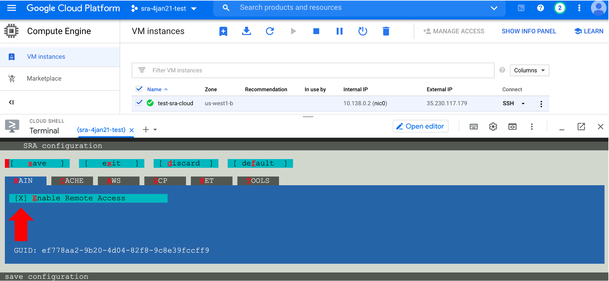
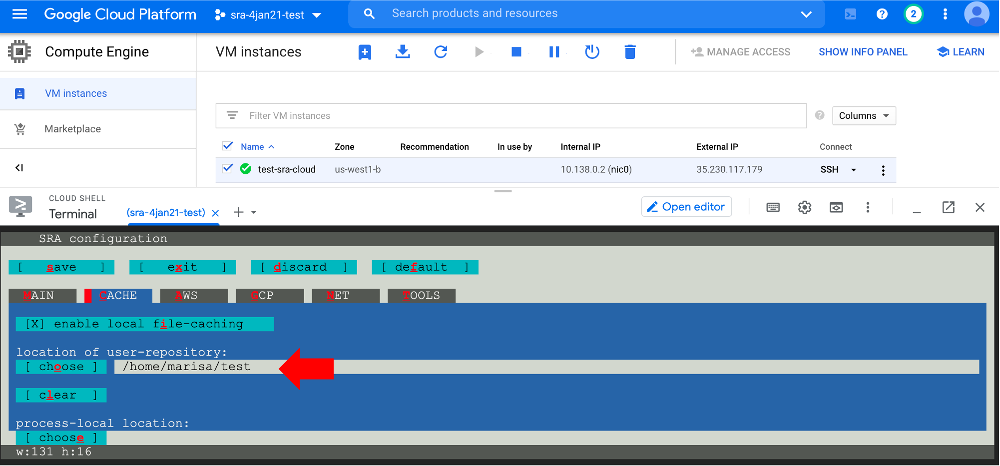
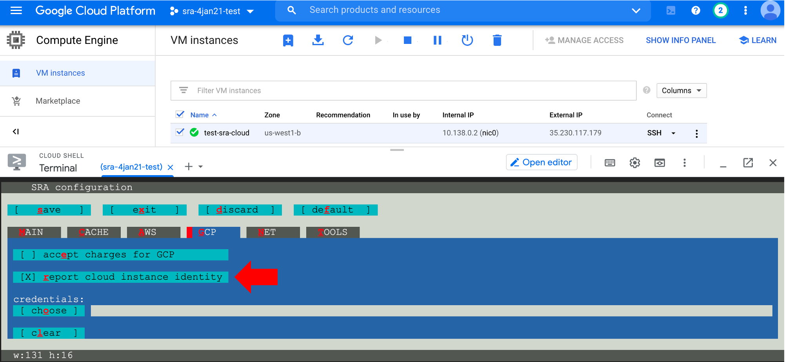

# Extra configuration steps

This is a holding space for configuration steps that have been needed at some point, but are no longer requirements in set up/examples.

1. The BLAST example used to require a VM with Firewall settings, but does not seem to anymore. SRA toolkit does not use Firewall settings. To streamline the VM set up steps, took Firewall config out.
2. SRA toolkit - `wget` download of SRA toolkit requires manual config. The config step is broken as of Feb 2021. Switched to using conda install steps that do not require config.

## 1. Firewall config
### e. Firewall setting


- Check the box by **Allow HTTP traffic** which opens port 80 (HTTP) and allows you to access the virtual machine.

!!! important

    If the Firewall settings are not enabled, you may get an error message when trying to connect to the VM:
     `Insufficient Permission: Request had insufficient authentication scopes`


## 2. Configure SRA toolkit

There are three configuration steps. The configuration instructions are detailed on the [SRA Github page](https://github.com/ncbi/sra-tools/wiki/03.-Quick-Toolkit-Configuration).

For the second step, we need an empty directory to store cached files. This makes a directory called "test":

```
mkdir test
```

Now, enter:

```
vdb-config -i
```

A new panel will open.

### Enable remote access

This setting tells sra-tools to look for data from remote servers at NCBI, Amazon Web Services (AWS), or GCP.

The first configuration is to ensure there is an ++x++ in the brackets by "Enable Remote Access":



### Configure cache

This configuration sets up a persistent cache for downloaded files, so they do not need to be accessed remotely multiple times.

- Type ++c++ to open the "Cache" tab.
- An ++x++ should be by “enable local file-caching”. If not, type ++i++ to select it.
- Type ++o++ to choose the “location of user-repository”. A green and yellow panel will open up.
- Use the ++down++ on your keyboard or your mouse to navigate to the empty directory, "test", we made in the previous step, type ++enter++.
- When your directory is selected, click the “OK” button (a red bar will appear next to "OK") and type ++enter++.
- Type ++y++ to change the location to the "test" directory


Check that the correct directory is printed under "location of user-repository":



### Report cloud instance identity

This setting tells sra-tools that we are using a GCP instance. Using this setting also improves file download speed.

- Type ++g++ to open the GCP tab.
- Type ++r++ to select “report cloud instance identity”.



Type ++s++ to save the settings and ++o++ to select ok. Then type ++x++ to exit the configuration page to return to the cloud shell. Configuration is complete!
