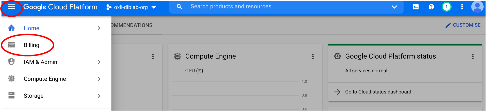
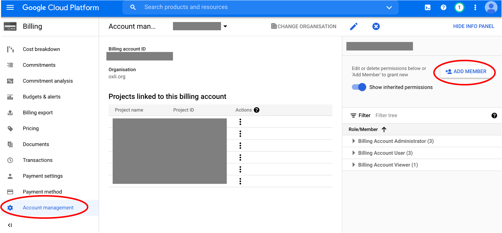
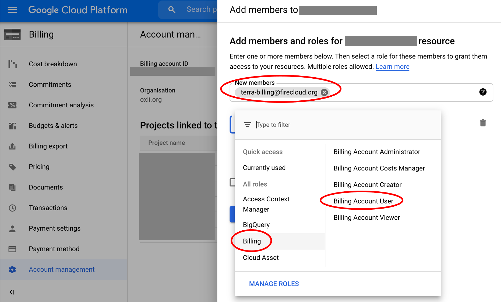
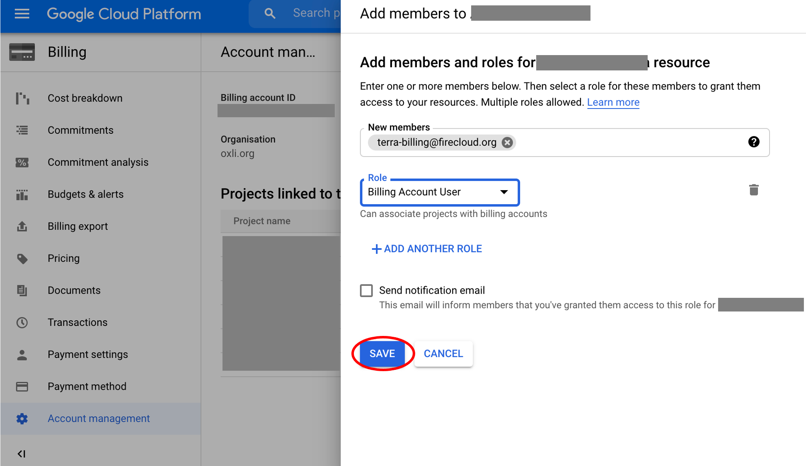
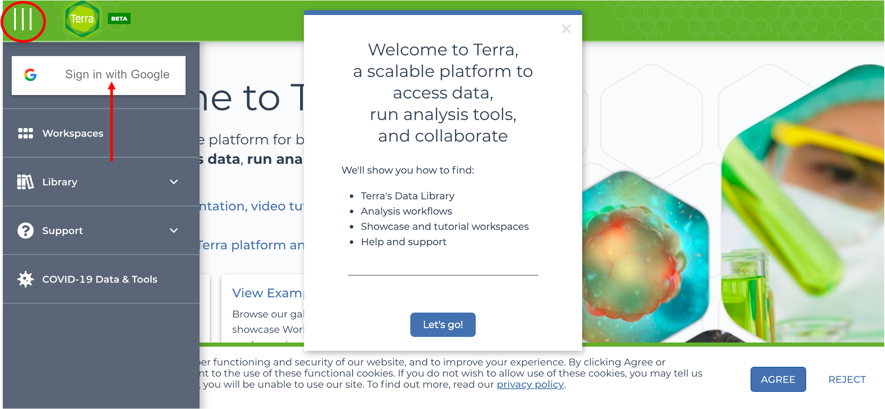
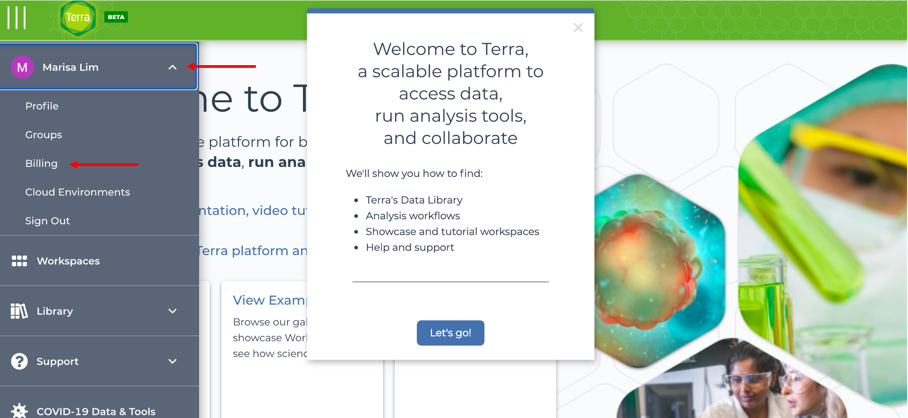
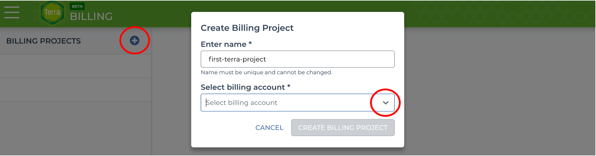

<div class="banner"><span class="banner-text">Lesson in Development</span></div>

# Setting up a Terra account


!!! important

    Please use **Google Chrome** to access the Google Cloud Platform console! Some features do not work in other web browsers.

## Step 1: Create GCP account

Terra uses the Google Cloud Platform (GCP) Compute Engine and Google Storage services to execute analyses and store data. Consequently, billing is managed by the GCP.

To use Terra, you'll need a GCP account and billing account. Please see our lesson for [setting up GCP accounts](../Introduction-to-GCP/index.md).

## Step 2: Link billing account <a name="link-terra-gcp"></a>

We have to give Terra permission to use our GCP billing account.

From the GCP console, navigate to the Account Management page by clicking the three lines and <span class="highlight_txt">Billing</span>:


Scroll down and click <span class="highlight_txt">Account management</span>. Then click <span class="highlight_txt">ADD MEMBER</span>:


If you don't see the option to add members, click <span class="highlight_txt">SHOW INFO PANEL</span> on the top right.

Add <span class="highlight_txt">terra-billing@firecloud.org</span> in the box for "New members". In the "Role" box below, look for "Billing" roles and select <span class="highlight_txt">Billing Account User</span>:


!!! note

    As of Feb 2021, Terra can be added to the GCP billing account as <span class="highlight_txt">terra-billing@firecloud.org</span> OR <span class="highlight_txt">terra-billing@terra.bio</span>. Either works!

    You may see both addresses used in the Terra support documentation.

Finally, click <span class="highlight_txt">SAVE</span>:


## Step 3: Log in to Terra

Now, we set up the billing information on the Terra side.

Go to: <https://app.terra.bio/>

Click on the three lines and log in with the same Google account you used to set up the GCP:


Click the dropdown arrow by your name and select <span class="highlight_txt">Billing</span>:


## Step 4: Set up Terra billing project

Click the <span class="highlight_txt">+</span>. Then enter a unique billing project name (the "first-terra-project" in the image below is a placeholder, please do not copy it as it's probably already in use!).

!!! warning

    The names for billing projects must be **completely unique**, not only for Terra, but for **all Google projects**. Terra creates a Google Project of the same name on your behalf so it cannot share the same name as any other project. Otherwise, the billing project creation will fail with an error message like this:

    ```
    project demo-for-tutorial2021 creation finished with errors: {"ResourceType":"cloudresourcemanager.v1.project","ResourceErrorCode":"400","ResourceErrorMessage":{"code":400,"message":"field [project_id] has issue [project_id contains prohibited words]","status":"INVALID_ARGUMENT","details":[{"@type":"type.googleapis.com/google.rpc.BadRequest","fieldViolations":[{"field":"project_id","description":"project_id contains prohibited words"}]},{"@type":"type.googleapis.com/google.rpc.Help","links":[{"url":"https://cloud.google.com/resource-manager/reference/rest/v1/projects"}]}],"statusMessage":"Bad Request","requestPath":"https://cloudresourcemanager.googleapis.com/v1/projects","httpMethod":"POST"}} - code RESOURCE_ERROR
    ```

Next, use the dropdown menu to select your GCP billing account. If you do not see your GCP billing account, please check [step 2](#link-terra-gcp). Then click <span class="highlight_txt">CREATE BILLING PROJECT</span>.



!!! warning

    It may take several minutes to complete billing project set up. Do not close the browser window, as this may cause set up to fail.

Once your billing project is created, you can create Terra workspaces or add collaborators. In the next lesson, we'll learn about workspaces.
