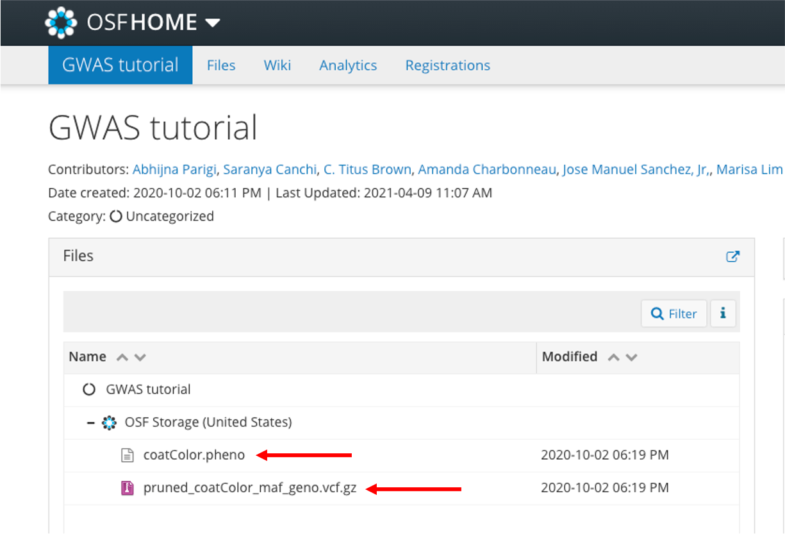
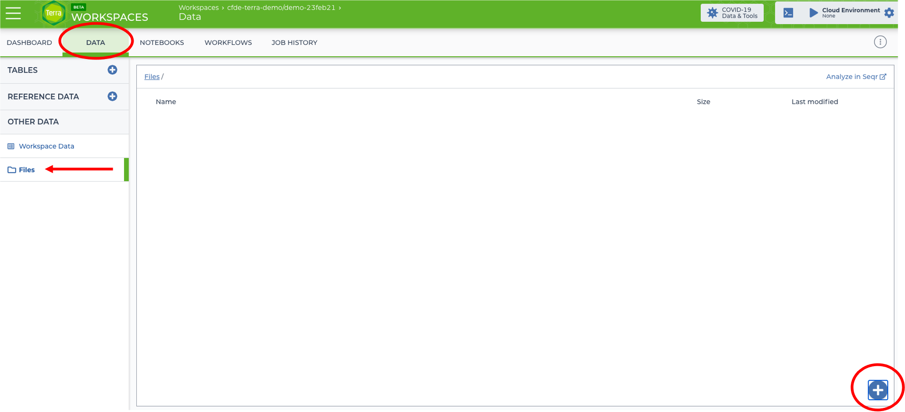

<div class="banner"><span class="banner-text">Lesson in Development</span></div>


# Running workflows in Terra


For this demo, we will show you how to run the same workflow as in the [Genome-wide Association Study (GWAS) lesson](../../Bioinformatic-Analyses/GWAS-in-the-cloud/index.md), but on Terra instead of AWS.

### Step 1: Download data

We are using 2 files for this example:

- a file that specifies dog coat color phenotype information ("coatColor.pheno")
- a variant call file ("pruned_coatColor_maf_geno.vcf.gz")

Download these files from our OSF repository: <https://osf.io/gajtk/>. Click on the file name:



Then click <span class="highlight_txt">Download</span> and save to your computer's Desktop:


### Step 2: Import data to workspace

Open the workspace created [in the previous section](./2terra.md) ([home page for all workspaces](https://app.terra.bio/#workspaces). The demo data files (".pheno" and ".vcf.gz") are small enough to manually upload to our Terra workspace.

Go to the <span class="highlight_txt">DATA</span> tab, click <span class="highlight_txt">Files</span>, and then click the <span class="highlight_txt">+</span> sign to add 1 file at a time to the workspace.



It may take a few seconds for the vcf file to upload.

!!! tip

    For larger datasets, you can upload files to the Terra workspace Google bucket location with the command line.

    === "On GCP VM"

        An example of this process is in the [GCP lesson example](../Introduction-to-GCP/gcp3.md).

    === "Local computer to Google storage"

        If you want to move local (on laptop) data to the cloud, you need a local installation of `gsutil` ([instructions](https://cloud.google.com/storage/docs/gsutil_install) for installation from GCP). Be sure to add `gcloud` to your system's PATH when asked during set up of the `gsutil` tool!

        Use the storage bucket location already associated with a Terra workspace when you upload the files. For example, we have a workspace with this bucket name, "gs://fc-a2cdb170-5198-4a53-a631-86d22564d199", which we renamed with the alias, "mybucket".

        ```
        # add alias
        export mybucket="gs://fc-a2cdb170-5198-4a53-a631-86d22564d199"

        # then we use gsutil to copy (cp) a file (file.txt) to the bucket
        gsutil cp file.txt $mybucket

        # alternatively, the -r flag recursively copies files from a directory to the bucket
        gsutil cp -r lots_of_files $mybucket
        ```

        After the files are in the bucket, they are accessible on Terra! Your files should be in the Data tab's Files page. To use the files in an analysis on Terra, you will then need to format the sample table section (next step below).

### Step 3: Set up data table

We've uploaded data, but we still have to tell Terra how to reference the input files. This will make it possible to select inputs when we set up the workflow.

<iframe id="kaltura_player" src="https://cdnapisec.kaltura.com/p/1770401/sp/177040100/embedIframeJs/uiconf_id/29032722/partner_id/1770401?iframeembed=true&playerId=kaltura_player&entry_id=1_hr10q0lo&flashvars[localizationCode]=en&amp;flashvars[leadWithHTML5]=true&amp;flashvars[sideBarContainer.plugin]=true&amp;flashvars[sideBarContainer.position]=left&amp;flashvars[sideBarContainer.clickToClose]=true&amp;flashvars[chapters.plugin]=true&amp;flashvars[chapters.layout]=vertical&amp;flashvars[chapters.thumbnailRotator]=false&amp;flashvars[streamSelector.plugin]=true&amp;flashvars[EmbedPlayer.SpinnerTarget]=videoHolder&amp;flashvars[dualScreen.plugin]=true&amp;flashvars[Kaltura.addCrossoriginToIframe]=true&amp;&wid=1_k8l7mh9q" width="608" height="402" allowfullscreen webkitallowfullscreen mozAllowFullScreen allow="autoplay *; fullscreen *; encrypted-media *" sandbox="allow-forms allow-same-origin allow-scripts allow-top-navigation allow-pointer-lock allow-popups allow-modals allow-orientation-lock allow-popups-to-escape-sandbox allow-presentation allow-top-navigation-by-user-activation" frameborder="0" title="Kaltura Player"></iframe>

There are 2 ways to enter sample information into the data tables:

1. Upload a TSV file. **We recommend for this lesson that you download [this sample TSV file](./terra_sample_tsv.tsv) and then upload it to the "Import Table Data" box.** In <span class="highlight_txt">TABLES</span>, click the <span class="highlight_txt">+</span> to "Import Table Data". Click the <span class="highlight_txt">Drag or Click to select a .tsv file</span>. Click <span class="highlight_txt">UPLOAD</span>.

2. As shown in the vidlet above, you can also copy/paste a tab-delimited table. However, please note that the tab delimiters are important and Terra will give a syntax error if it cannot parse the tabs. In <span class="highlight_txt">TABLES</span>, click the <span class="highlight_txt">+</span> to "Import Table Data". Switch to the <span class="highlight_txt">TEXT IMPORT</span> tab and copy/paste your sample table. Click <span class="highlight_txt">UPLOAD</span>.

For either approach, you must edit the file names with the pencil icon so they include the google bucket path, otherwise it's just a string of the file name with no location information (you'll know it's correct when the file name has a hyperlink and opens the download window). The bucket path is available from the <span class="highlight_txt">Files</span> tab by clicking on the uploaded file name. Copy the part that looks like: "gs://fc-a2cdb170-5198-4a53-a631-86d22564d199/coatColor.pheno" (**the exact `gs://` will be unique to your workspace**).

### Step 4: Run the workflow!

<iframe id="kaltura_player" src="https://cdnapisec.kaltura.com/p/1770401/sp/177040100/embedIframeJs/uiconf_id/29032722/partner_id/1770401?iframeembed=true&playerId=kaltura_player&entry_id=1_quwi5729&flashvars[localizationCode]=en&amp;flashvars[leadWithHTML5]=true&amp;flashvars[sideBarContainer.plugin]=true&amp;flashvars[sideBarContainer.position]=left&amp;flashvars[sideBarContainer.clickToClose]=true&amp;flashvars[chapters.plugin]=true&amp;flashvars[chapters.layout]=vertical&amp;flashvars[chapters.thumbnailRotator]=false&amp;flashvars[streamSelector.plugin]=true&amp;flashvars[EmbedPlayer.SpinnerTarget]=videoHolder&amp;flashvars[dualScreen.plugin]=true&amp;flashvars[Kaltura.addCrossoriginToIframe]=true&amp;&wid=1_gumloey7" width="608" height="402" allowfullscreen webkitallowfullscreen mozAllowFullScreen allow="autoplay *; fullscreen *; encrypted-media *" sandbox="allow-forms allow-same-origin allow-scripts allow-top-navigation allow-pointer-lock allow-popups allow-modals allow-orientation-lock allow-popups-to-escape-sandbox allow-presentation allow-top-navigation-by-user-activation" frameborder="0" title="Kaltura Player"></iframe>

#### Find workflow
- Go to the <span class="highlight_txt">WORKFLOWS</span> tab, click the <span class="highlight_txt">+</span>, select the <span class="highlight_txt">Broad Methods Repository</span>
- The next page will ask you to sign in with a Google account. Click the <span class="highlight_txt">Sign in with Google</span> button and use your Terra login information to sign in. Accept terms of service.
- Under <span class="highlight_txt">Public Methods</span>, select <span class="highlight_txt">GWAS-demo</span>
- Click on <span class="highlight_txt">Export to Workspace</span>, select <span class="highlight_txt">Use Blank Configuration</span>, select your Terra workspace and click <span class="highlight_txt">Export to Workspace</span>
- Click <span class="highlight_txt">Yes</span> to return to Terra

#### Set up workflow
- Go to the <span class="highlight_txt">DATA</span> tab, check the box next to the row of data we uploaded. Click the 3 vertical dots and select <span class="highlight_txt">Open with...</span> a <span class="highlight_txt">Workflow</span>
- Specify the inputs as "this." and the file attribute name and click <span class="highlight_txt">SAVE</span>:

Variable | Attribute
--- | ---
inputpheno | this.pheno
inputvcf | this.vcf
sample_name | this.sample_id

- Specify the outputs by clicking <span class="highlight_txt">Use defaults</span> and <span class="highlight_txt">SAVE</span>
- Finally, click <span class="highlight_txt">RUN ANALYSIS</span> and <span class="highlight_txt">LAUNCH</span>
- The job will be added to the queue. Check the job manager to see if job is running.

!!! tip

    This example workflow takes 10-15 minutes to complete. However, the job may sit in the queue for a while before starting (anywhere from a few minutes to a few hours). Since Terra currently does not notify you (i.e., via email) when a job successfully, starts, completes, or fails, be sure to check the job manager for status updates.


### Step 5: Check outputs!

<iframe id="kaltura_player" src="https://cdnapisec.kaltura.com/p/1770401/sp/177040100/embedIframeJs/uiconf_id/29032722/partner_id/1770401?iframeembed=true&playerId=kaltura_player&entry_id=1_4aiosz9j&flashvars[localizationCode]=en&amp;flashvars[leadWithHTML5]=true&amp;flashvars[sideBarContainer.plugin]=true&amp;flashvars[sideBarContainer.position]=left&amp;flashvars[sideBarContainer.clickToClose]=true&amp;flashvars[chapters.plugin]=true&amp;flashvars[chapters.layout]=vertical&amp;flashvars[chapters.thumbnailRotator]=false&amp;flashvars[streamSelector.plugin]=true&amp;flashvars[EmbedPlayer.SpinnerTarget]=videoHolder&amp;flashvars[dualScreen.plugin]=true&amp;flashvars[Kaltura.addCrossoriginToIframe]=true&amp;&wid=1_4z5fljx2" width="608" height="402" allowfullscreen webkitallowfullscreen mozAllowFullScreen allow="autoplay *; fullscreen *; encrypted-media *" sandbox="allow-forms allow-same-origin allow-scripts allow-top-navigation allow-pointer-lock allow-popups allow-modals allow-orientation-lock allow-popups-to-escape-sandbox allow-presentation allow-top-navigation-by-user-activation" frameborder="0" title="Kaltura Player"></iframe>

When the workflow completes successfully, the <span class="highlight_txt">JOB HISTORY</span> tab will show the job information and with the job status "Succeeded".

You can find more information about the Job history for each step of the workflow by clicking the "Job Manager" icon. The workflow outputs are available in the <span class="highlight_txt">DATA</span> tab. Click on the files to download the outputs. The final output of this workflow is a Manhattan plot. It will cost >$1 per file.

In the next lesson, we'll show you how we built the GWAS workflow.
