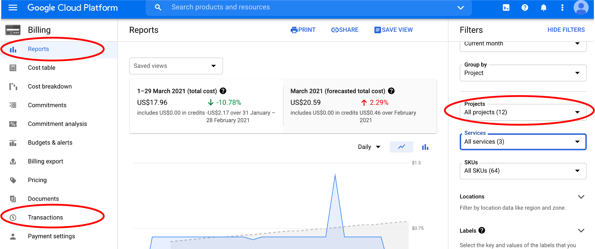

Lesson in Development

# Let's talk about cloud costs

## Monitoring costs

The Terra platform is under active development. Currently, the platform itself does not show workflow costs.

!!! Info

    Keep an eye on [this Terra article about workflow cost monitoring](https://support.terra.bio/hc/en-us/articles/360037862771-How-much-did-a-workflow-cost-) for updates!

The GCP does **not** track individual workflow or workspace costs. GCP charges are reported by **Terra billing project**. As you get started with GCP and Terra, it is best to carefully monitor how costs accrue from running demo or scaled down projects so you can better estimate cost patterns.

For now, keep track of Terra expenses from the billing account section of the GCP console. Invoice information can be found in the Transactions section and expenses can be viewed by *Terra billing project* from the Reports section (select a Project).

The three main elements of cloud computing that cost you money on Terra are:

1. Running an analysis
2. Downloading files from Terra (i.e., to a local computer); also known as egress
3. Uploading/storing files on the Google Cloud Storage bucket associated with Terra workspaces

## Running a workflow

When you run a workflow or do work in a Jupyter notebook or on Rstudio, Terra starts up a GCP virtual machine. The price rates depend on the cloud configurations you choose (default or custom).

For small analyses, costs are quite reasonable. For example, running through two Terra Quickstart tutorials cost us <$1.

The [Google Cloud pricing calculator](https://cloud.google.com/products/calculator/#id=) is also a helpful tool to estimate the cost of GCP compute resources.

## Egress

Egress expenses are associated with downloading local copies of data or moving data between storage cloud regions. They typically cost $0.01/Gb in the United States.

You can preview the cost to download individual data files before downloading.

## Storage

Data (i.e., input data, output results files) storage costs are set by GCP price rates, and are currently low but variable.

Data storage prices are more expensive for data that need to be accessed quickly and frequently - $0.026/Gb/month (multi-regional) to $0.020/Gb/month (regional). Data that is accessed infrequently (e.g., archived processed sequence files) can be stored on Nearline or Coldline storage systems, where the prices range from $0.01/Gb (Nearline) to $0.007/Gb (Coldline) for storage and $0.01/Gb (Nearline) to $0.05/Gb (Coldline) for data retrieval.

More information is available about:

- monitoring expenses from the GCP console ([GCP documentation](https://cloud.google.com/billing/docs))
- Terra billing projects and setting up permissions ([support documentation](https://support.terra.bio/hc/en-us/articles/360026182251-How-to-set-up-billing-in-Terra))

!!! note "Key Points"

    This concludes the introduction to Terra lesson. You should now be able to set up your own Terra account, link it to your GCP account, and use the Terra platform interface with existing workflows!
