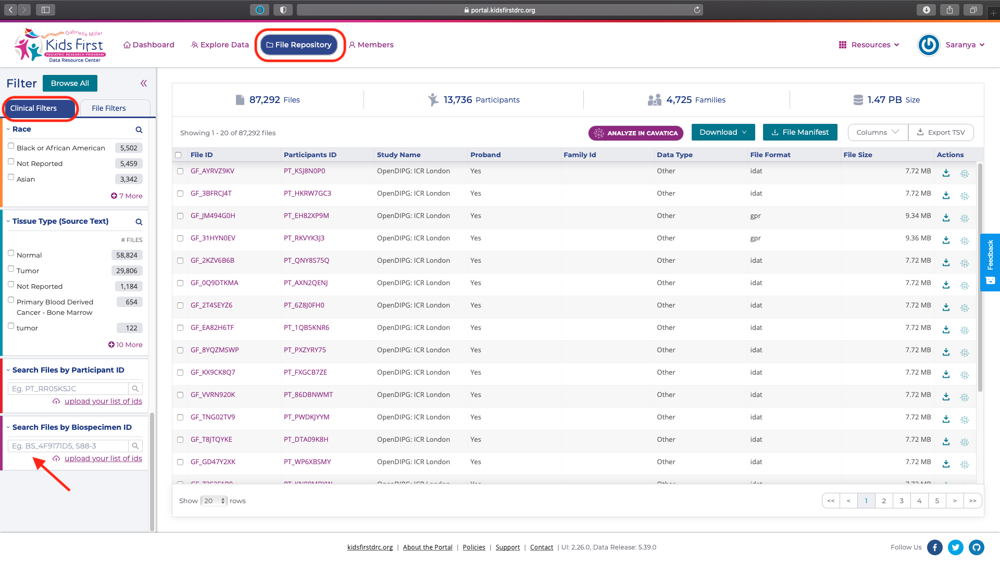
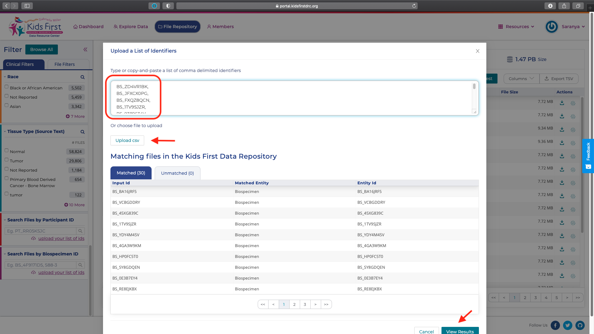
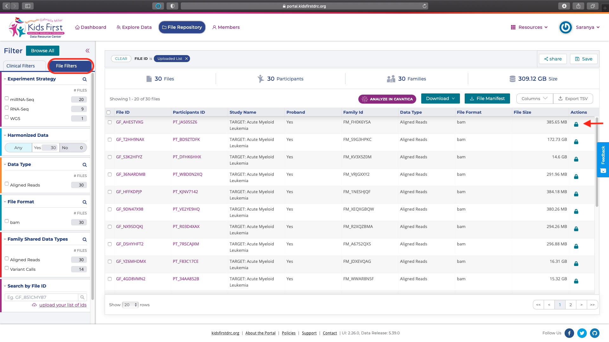
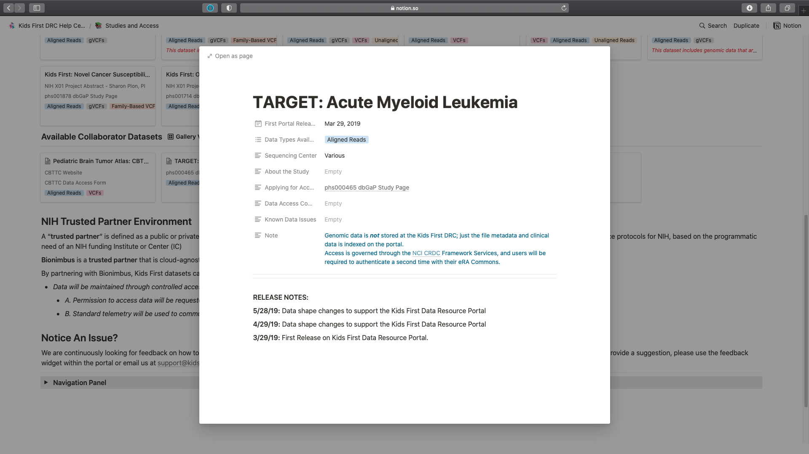
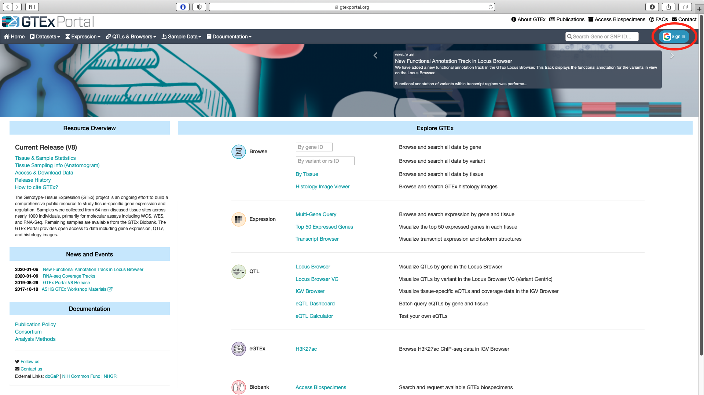
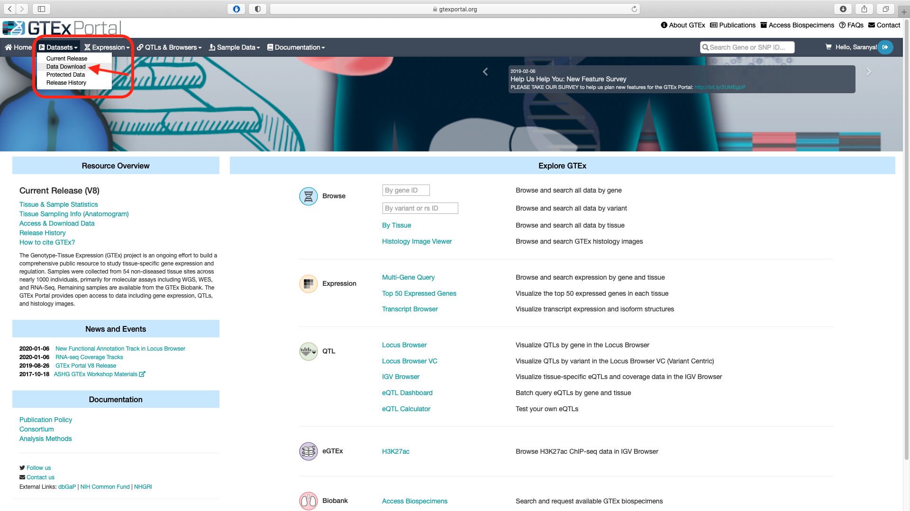
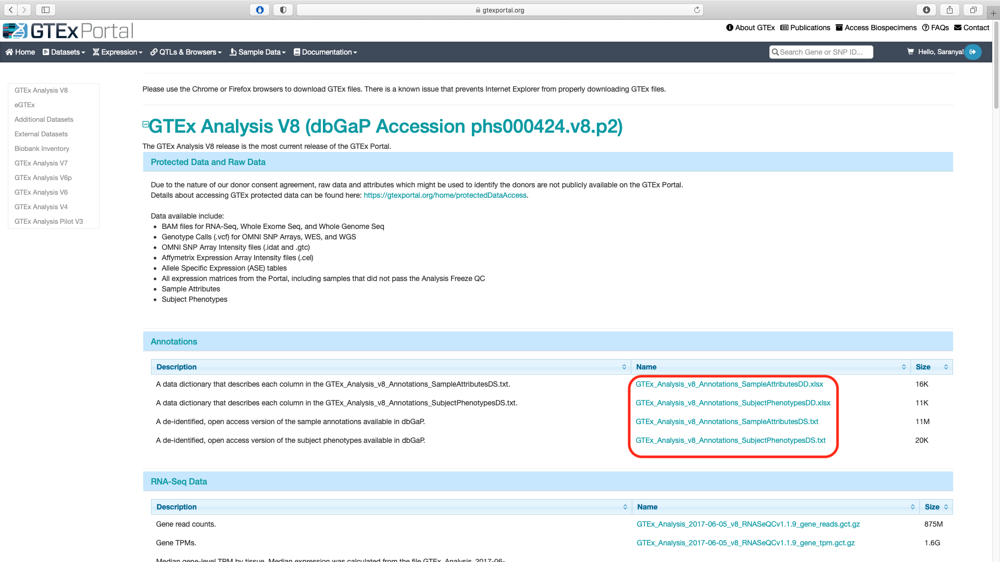
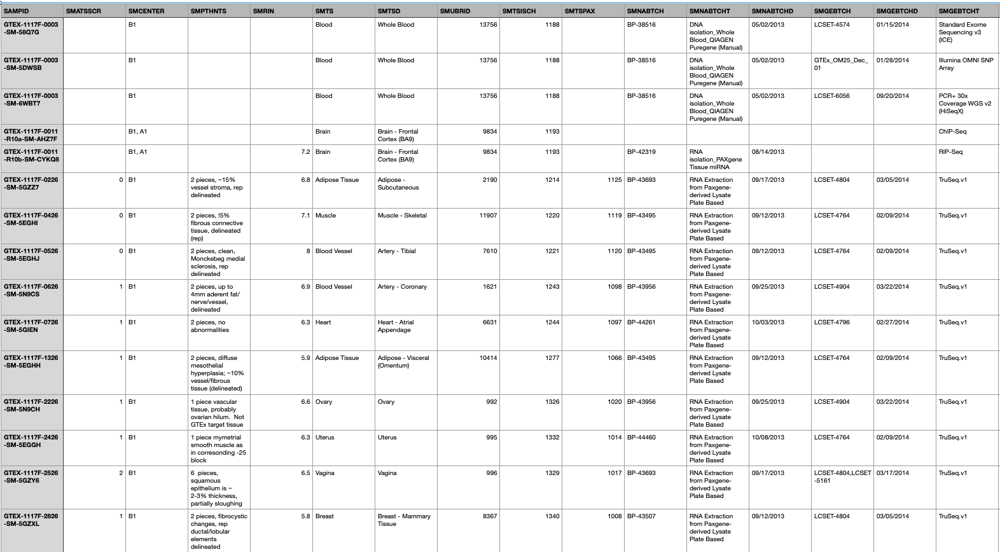
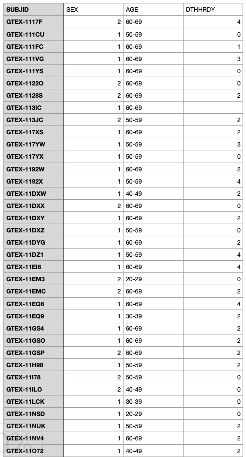

Lesson in Development

# Blood Datasets from CF Program Portals

[Using the `csv` manifest details we just exported from the CFDE portal](./blood-cancer-portal-export.md), the associated data files can be accessed from data portals of the individual Common Fund programs, [GTEx](https://gtexportal.org/home/) and [KF](https://kidsfirstdrc.org/) respectively. In this use case, the selected cohort from the CFDE Portal represents genomic and transcriptomic data from blood of healthy individuals (GTEx) and individuals with acute myeloid leukemia (KF).

## KF Data Portal

[The Gabriella Miller Kids First Data Resource Center (KF)](https://kidsfirstdrc.org/) provides researchers access to data collected from children affected with cancer and structural birth defects to enable new discoveries and treatment strategies.

!!! note "Login"
    [Follow our guide to login into the KF data portal](../../Kids-First/Portal-Setup-And-Permissions/KF_3_KF_Registration.md) which is via one of the three routes including ORCID, Google or Facebook.

After login, select the "File Repository" and in the "Clinical Filters" tab, scroll all the way to the bottom to choose the "Search Files by Biospecimen ID". Click on "upload your list of ids".

You can paste the comma separated list of IDs which is same as the values in the `id` column of the exported file from the portal. Alternatively, you can upload a file that contain only the relevant KF `ids` as a comma separated list. Choose "View Results" to view all the associated metadata data.

The resulting view in the portal lists all the participants and files associated with the study. Using the "File Filters" tab the details of the experimental strategy, data type and file formats can be viewed. The lock icon under the "Actions" column implies protected data and access has to be requested.

Request for the controlled data access for the AML dataset can be applied through [National Cancer Institute's Cancer Research Data Commons](https://datascience.cancer.gov/data-commons).

## GTEx Data Portal

[The GTEx project](https://gtexportal.org/home/) is an ongoing effort to build a comprehensive public resource to study tissue-specific gene expression and regulation. Data was collected from over 1000 individuals across 54 non-diseased tissue sites and thus represent baseline values.

!!! note "GTEx Portal"
    The portal website address is listed in the exported csv file for the CFDE portal in both the `id_namespace` and in the `project_id_namespace` columns.

Login in to the portal is via Google credentials.

The relevant data available for download can be accessed via the `Datasets` option in the main menu bar.

The subject and sample level metadata are listed under the `Annotations` tab on the latest data release page. The plain text files ending in `.txt` contain the sample and subject annotations while the excel files ending in `.xlsx` contain the dictionary for all the columns listed in the sample and subject annotations files.

The sample annotations file contains the `SAMPID` that correspond to the `ID` column in the exported `csv` file from the CFDE portal.

The subject annotations file contains `SUBJID` which corresponds to the first ten characters of the `SAMPID`.

These lists can be combined and filtered to obtain subjects and data corresponding to blood DNA and RNA samples from individuals in the youngest age bracket to make comparable analysis with the KF AML data.

Based on the filtered cohort, a researcher can access the [GTEx data](https://gtexportal.org/home/protectedDataAccess) after approval of dbGAP controlled access application.
