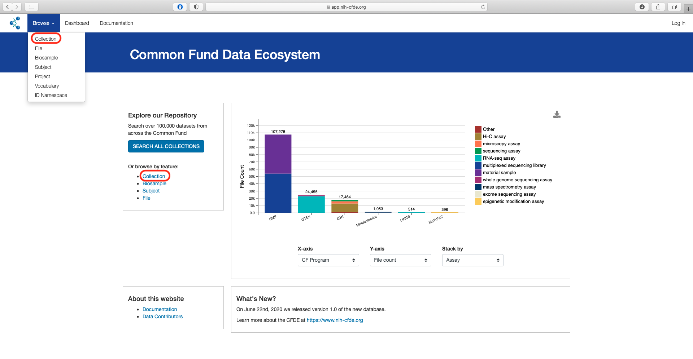
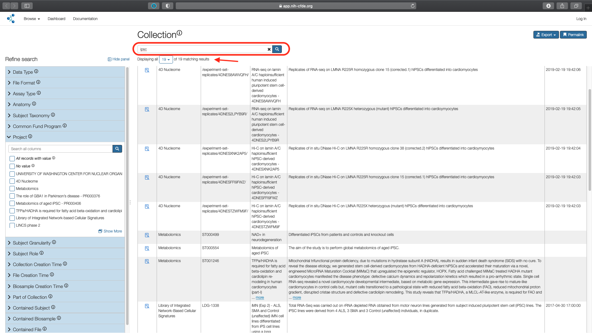
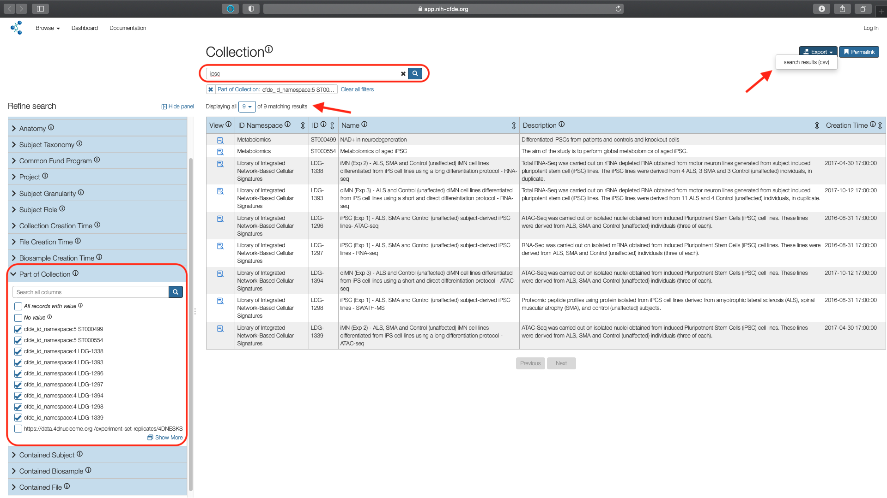
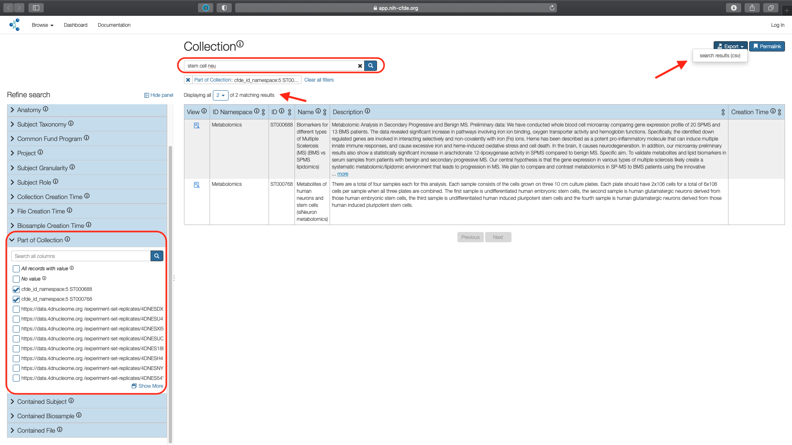
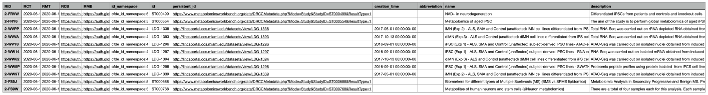

This tutorial is outdated. Please refer to the Common Fund Tools page for up-to-date tutorials.

# Multi-omics Data Discovery for Movement-Related Disorders

Movement-related disorders affect the neuromuscular system, disrupting the ability of the nervous and muscular systems to work together. There are several known movement-related disorders, including Amyotrophic Lateral Sclerosis (ALS) or Lou Gehrig’s disease, Parkinson's disease, Spinal Muscular Atrophy (SMA) and Multiple Sclerosis (MS).

- Amyotrophic Lateral Sclerosis (ALS): is a motor neuron disease which involves the loss of neurons in the brain and spinal cord that control voluntary movement of the muscles. ALS is not heritable.

- Spinal Muscular Atrophy (SMA): is a heritable motor neuron disease with known genetic causes.

- Parkinson's disease: is a degenerative condition which results from the death of dopamine producing neurons.

- Multiple Sclerosis (MS): is an autoimmune disorder in which myelin, the protective sheath covering the neurons, is damaged disrupting communications between brain and rest of the body including movement.

A few common features of these neuromuscular disorders are that they all involve the brain, share many symptoms, and are all difficult to diagnose in their early stages. Identifying key genomic, transcriptomic and/or proteomic differences between these conditions may help elucidate underlying disease mechanisms along with potential biomarkers that may aid in early diagnosis and/or targeted drug development.

In this use case, we demonstrate the utility of the [CFDE portal](https://app.nih-cfde.org) in identifying and extracting suitable datasets of human origin spanning the spectrum of movement-related disorders from across the CF programs.

A video walk through demonstrating the cohort selection for Movement-Related Disorders.

<iframe id="kaltura_player" src="https://cdnapisec.kaltura.com/p/1770401/sp/177040100/embedIframeJs/uiconf_id/29032722/partner_id/1770401?iframeembed=true&playerId=kaltura_player&entry_id=1_v3ggfiv3&flashvars[mediaProtocol]=rtmp&amp;flashvars[streamerType]=rtmp&amp;flashvars[streamerUrl]=rtmp://www.kaltura.com:1935&amp;flashvars[rtmpFlavors]=1&amp;flashvars[localizationCode]=en&amp;flashvars[leadWithHTML5]=true&amp;flashvars[sideBarContainer.plugin]=true&amp;flashvars[sideBarContainer.position]=left&amp;flashvars[sideBarContainer.clickToClose]=true&amp;flashvars[chapters.plugin]=true&amp;flashvars[chapters.layout]=vertical&amp;flashvars[chapters.thumbnailRotator]=false&amp;flashvars[streamSelector.plugin]=true&amp;flashvars[EmbedPlayer.SpinnerTarget]=videoHolder&amp;flashvars[dualScreen.plugin]=true&amp;flashvars[Kaltura.addCrossoriginToIframe]=true&amp;&wid=1_ik6qjpq6" width="608" height="402" allowfullscreen webkitallowfullscreen mozAllowFullScreen allow="autoplay *; fullscreen *; encrypted-media *" sandbox="allow-forms allow-same-origin allow-scripts allow-top-navigation allow-pointer-lock allow-popups allow-modals allow-orientation-lock allow-popups-to-escape-sandbox allow-presentation allow-top-navigation-by-user-activation" frameborder="0" title="Kaltura Player"></iframe>

## Step 1: Access the Collection information

From the main landing page for the [CFDE portal](https://app.nih-cfde.org) there are two
options to access the "Collection" view of the CFDE data browser.

By using the "Collection" link under the "Or browse by feature" section listed
under "Explore our Repository" or by selecting "Collection" under the "Browse" option in the top left navigation bar.

   

The default page shows a total of 2,990 records.

## Step 2: Search all columns: IPSC

Use the "Search all columns" box to identify datasets using **IPSC** (induced pluripotent stem cell) lines.

!!! note "Case-insensitive"
    The search is case-insensitive. One will obtain the same results for "IPSC" or "ipsc" or any combination of the two.

   

This results in 19 records.

## Step 3: Subset using Part of Collection

Use the "Part of Collection" filter listed under the Refine Search panel to select the desired datasets ["ID" values : ST000499, ST000554, LDG-1296, LDG-1297, LDG-1298, LDG-1393, LDG-1394,
LDG-1338, LDG-1339].

   

This results in 9 matching records from Metabolomics and Library of Integrated Network-Based Cellular Signatures (LINCS). The subset cohort is exported to a `csv` file using the "Export" option.

!!! note "Download to local machine"
    The exported `csv` file can be accessed from the downloads folder associated with the web browser in the user's local machine. Default is generally the `Downloads` folder.

## Step 4: Search all columns: Stem Cell

The associated datasets use either IPSC or neural stem cells in their experimental design. In the second part of the cohort building we will identify datasets that use neural stem cells as the experimental sample.

Use "Clear all filters" to remove the previous selection and type **stem cell neu** keyword in the "Search all columns" box. Use the "Part of Collection" filter listed under the Refine Search panel to select the desired datasets ["ID" values : ST000688, ST000768].

!!! note "Duplicated studies"
    The two LINCS datasets (LDG-1338, LDG-1393) in the subset are not selected as they are already included in the previous filtered list.

This results in two records and are exported to a second `csv` file using the "Export" option.

## Step 5: Combine Cohorts

The two CFDE portal exported `csv` files are combined into a single `csv` file in the user's local machine to obtain the final dataset. The exported `csv` file has twelve columns.

   

The relevant individual study details are in the `id`, `name` and `description` columns. The `persistant_id` column lists the permanent URL which can be used to access each of the studies in [Metabolomics](https://www.metabolomicsworkbench.org) and [LINCS](http://lincsportal.ccs.miami.edu/datasets/) data portals respectively.
