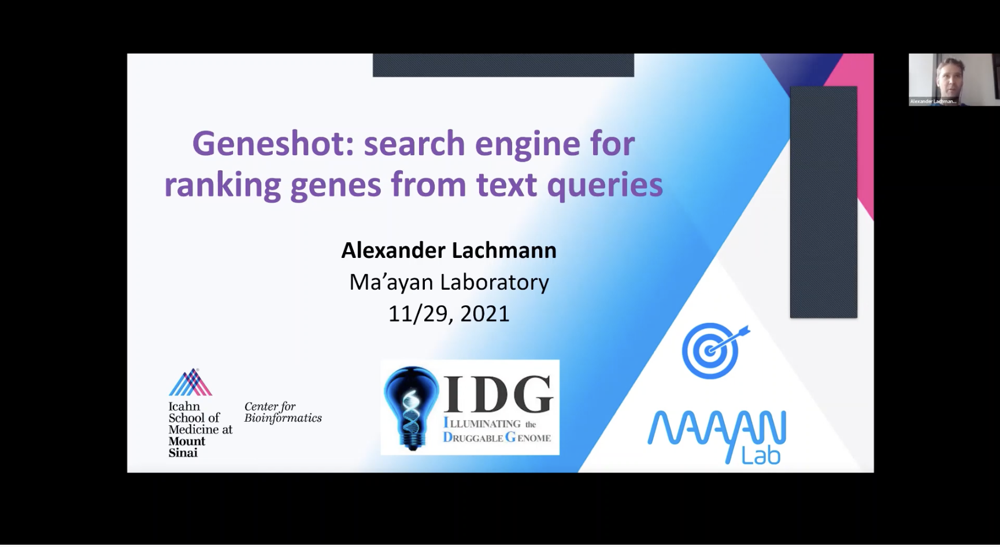
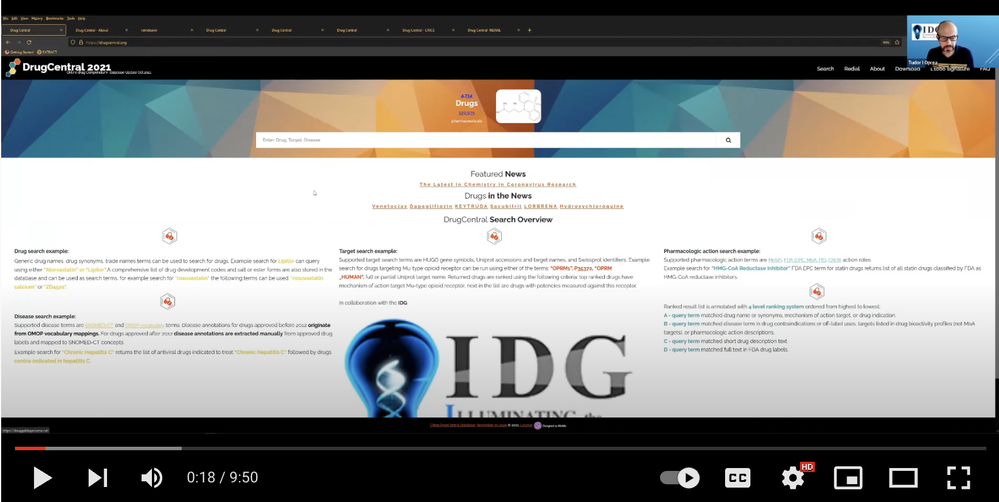

# Illuminating the Druggable Genome (IDG) Tutorials

The NIH funded the [Illuminating the Druggable Genome (IDG)](https://druggablegenome.net/) program to improve our understanding of the properties and functions of proteins that are currently under-annotated within the three most commonly drug-targeted protein families: G-protein coupled receptors, ion channels, and protein kinases. 

Since 2014, the IDG Knowledge Management Center (IDG-KMC) has generated several open-access datasets and resources that jointly serve as a highly translational machine-learning-ready knowledgebases focused on human protein-coding genes and their products. The goal of the IDG-KMC is to develop comprehensive integrated knowledge for the druggable genome to illuminate the uncharacterized or poorly annotated portion of the druggable genome. 

The tools derived from the IDG-KMC provide either user-friendly visualizations or ways to impute knowledge about potential targets using machine learning strategies. For step-by-step descriptions on how to use each web-based tool to accelerate illumination in under-studied proteins check out our [Current Protocols doi: 10.1002/cpz1.355](https://currentprotocols.onlinelibrary.wiley.com/doi/10.1002/cpz1.355).

Here, we provide links to and descriptions of some recent video tutorials and presentations on IDG tools and resources. You can also subscribe to the [IDG YouTube Channel](https://www.youtube.com/c/DruggableGenomeIDG/videos) to stay up-to-date on new topics.  

## Interacting with the Pharos User Interface

* Presenter: Tim Sheils, NCATS (IDG KMC)
* Demo outcome: Participants will learn how to browse through [Pharos](https://pharos.nih.gov/), upload and save lists, analyze lists, and get predicted ligand interactions. 
* IDG Grant: KMC-UNM U24CA224370 and publication: https://doi.org/10.1093/nar/gkaa993
* Link to digital tool: <https://pharos.nih.gov/>
* Link to video tuorial: <https://youtu.be/1FKp0gskGhU> 

## Pharos GraphQL API

* Presenters: Keith Kelleher, NCATS (IDG KMC) 
* Demo Outcome: Participants will learn how to query the [Pharos API](https://pharos.nih.gov/api) using GraphQL. 
* IDG Grant: KMC-UNM U24CA224370 
* Link to digital tool: <https://pharos.nih.gov/api>
* Link to video tuorial: <https://youtu.be/EVir_va8xaY>

## The Harmonizome Resource

* Presenter: Avi Ma'ayan
* Description: [Harmonizome](https://maayanlab.cloud/Harmonizome) is a collection of processed datasets gathered to serve and mine knowledge about genes and proteins from over 70 major online resources. We extracted, abstracted and organized data into ∼72 million functional associations between genes/proteins and their attributes. 
* Demo Outcome: Understanding the concepts behind constructing the Harmonizome. 
* Publication: <https://doi.org/10.1093/database/baw100>
* IDG Grant: KMC-ISMMS U24CA224260
* Link to digital tool: <https://maayanlab.cloud/Harmonizome>
* Link to video tuorial: <https://www.youtube.com/watch?v=yGkIQjeWh9U&t=26s>

## The ARCHS4 Fesource

* Presenter: Alexander Lachmann
* Description: ARCHS4 provides access to gene counts for over 1 million samples uniformly processed from RNA-seq studies for human and mouse experiments from GEO and SRA. 
* Demo Outcome: Using the ARCHS4 user interface; Accessing ARCHS4 programmatically; Making gene function predictions with data from ARCHS4. 
* IDG Grant: KMC-ISMMS U24CA224260
* Link to digital tool: https://maayanlab.cloud/archs4/
* Link to video: https://youtu.be/IxZHyf2bPjQ

## Making Predictions about Gene Function with PrismExp

* Presenter: Alexander Lachmann
* Description: In this e-IDG lecture Dr. Alexander Lachmann, an Assistant Professor from the Ma&#39;ayan Lab at ISMMS, describes three projects: [PrismExp](https://appyters.maayanlab.cloud/#/PrismEXP), blitzGSEA, and bridgeGSEA. These are three related methods to predict gene function and incorporate such predictions within gene set enrichment analyses. 
* Publication: <https://www.biorxiv.org/content/10.11>
* Link to digital tool: <https://appyters.maayanlab.cloud/#/PrismEXP>
* Link to video: <https://youtu.be/6gDzA2dfOrI>

## Using Geneshot to illuminate knowledge about understudied targets

* Description: The [Geneshot](https://maayanlab.cloud/geneshot/) search engine developed to illuminate and promote attention to the under-studied genome producing ranked gene lists contain genes that were previously published in association with the search terms, as well as genes predicted to be associated with the terms based on data integration from multiple sources. 
* Presenter: Alexander Lachmann, ISMMS (IDG KMC) 
* Demo outcome: Using the Geneshot user interface; Accessing Geneshot programmatically; Making gene function predictions with data from Geneshot. 
* IDG Grant: KMC-ISMMS U24CA224260 
* Publication: <https://doi.org/10.1093/nar/gkz393>
* Link to Digital tool: <https://maayanlab.cloud/geneshot/>
* Link to video: <https://youtu.be/VyNL7WzwQtk>

## Exploring Under-studied Targets with TIN-X

* Description: [TIN-X Target Importance and Novelty eXplorer (TIN-X)](https://newdrugtargets.org) is an interactive visualization tool for illuminating associations between diseases and potential drug targets 
* Presenter: Vincent T. Metzger, UNM (IDG KMC) 
* Demo Outcome: Using TIN-X to visually explore understudied drug targets; Demonstration of interactive features of the TIN-X User Interface. 
* IDG Grant: KMC-UNM U24CA224370 
* Publication: <https://doi.org/10.1093/bioinformatics/btx200>
* Link to digital tool: <https://newdrugtargets.org>
* Link to video: <https://youtu.be/vBheOcupvAQ>

## Interacting with the DrugCentral User Interface

* Description: DrugCentral – Online drug compendium with annotations of mechanism of action for clinically approved drugs. 
* Presenter: Tudor Oprea, UNM (IDG KMC) 
* Demo Outcome: Participants will learn about the information content currently included in DrugCentral, from mode-of-action drug targets to side effects, chemical information, and drug formulations. The use of the L1000 gene profile similarity for drugs and the machine learning prediction of anti-SARS-CoV-2 activities will also be discussed. 
* IDG Grant: KMC-UNM U24CA224370 
* Link to digital tool: <https://drugcentral.org>
* Link to video: <https://youtu.be/2Nu689No4H0>

## GWAS Target Illumination with TIGA

* Description: [TIGA – Target Illumination GWAS Analytics](https://unmtid-shinyapps.net/shiny/tiga/), an algorithm, automated workflow, and web application providing rational ranking, filtering and interpretation of inferred gene–trait associations and aggregated GWAS evidence by leveraging existing curation and harmonization efforts from the NHGRI-EBI GWAS Catalog. 
* Presenter: Jeremy Yang, UNM (IDG KMC) 
* Demo outcome: This demo will feature the TIGA web app as a tool for conveniently finding, prioritizing, and exploring gene-trait associations from aggregated GWAS evidence, in the context of drug target illumination scientific use cases. 
* IDG Grant: KMC-UNM U24CA224370 
* Publication: <https://doi.org/10.1093/bioinformatics/btab427>
* Link to digital tool: <https://unmtid-shinyapps.net/shiny/tiga/>
* Link to video: <https://youtu.be/vK8K39BIq80>

## Prioritizing Kinases for Lists of Proteins and Phosphoproteins with KEA3

* Description: In this e-IDG presentation, Anna Calinawan, a Software Engineer from the Wang Lab, describes a collaborative project between the Ma&#39;ayan Lab and Pei Wang Lab at ISMMS where we apply kinase enrichment analysis to analyze phosphoproteomics data from the NCI CPTAC program. 
* Presenters: Anna Calinawan and Pei Wang
* Link to digital tool: <https://pancan-kea3.cptac-data-view.org>
* Link to tool: <https://youtu.be/a0tbojE9DEU>
* Link to video: <https://youtu.be/a0tbojE9DEU>

## Converting PubMed searches to Drug Sets with the DrugShot Appyter

* Description: In this e-IDG lecture, Eryk Kropiwnicki, a Data Scientist from the Ma&#39;ayan Lab, presents [DrugShot](https://maayanlab.cloud/drugshot/), a web-based application and an Appyter that converts PubMed searches into ranked lists of drugs and other small molecules based on literature co-mentions. DrugShot also makes predictions about additional relevant drugs based on drug-drug LINCS L1000 gene expression similarity.
* Links to digital tools: The DrugShot website can be accessed at: [https://maayanlab.cloud/drugshot/](https://maayanlab.cloud/drugshot/). The DrugShot Appyter can be accessed at: [https://appyters.maayanlab.cloud/#/DrugShot](https://appyters.maayanlab.cloud/#/DrugShot)
* Link to video: <https://youtu.be/m2bVYhF7MHo>
