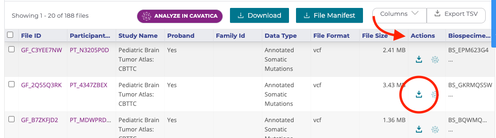

Download KF Data from the KF Portal
================================================

The easiest way to download a small number of files (one by one) onto your local machine is via the Kids First (KF) Portal interface.

* On the [KF Portal](https://portal.kidsfirstdrc.org/dashboard), identify your files of interest and look for the "Actions" column.

* In the "Actions" column, click on the little downward arrow located on the same row as your file of interest (shown in figure below)

* A pop-up window will appear - choose the folder in which you would like to download the file. If no pop-up window appears, look for your file in your default downloads folder (e.g. default folder for download on a MacOS is "Downloads").
