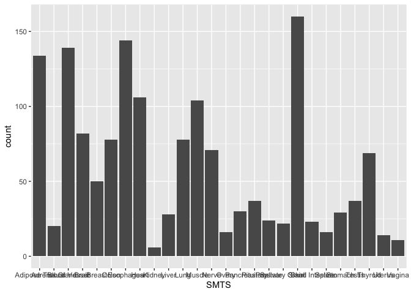
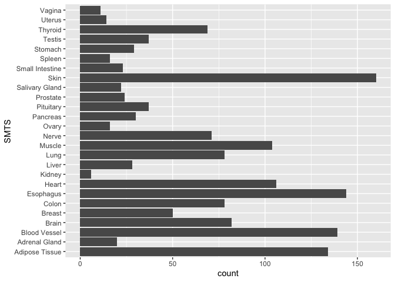
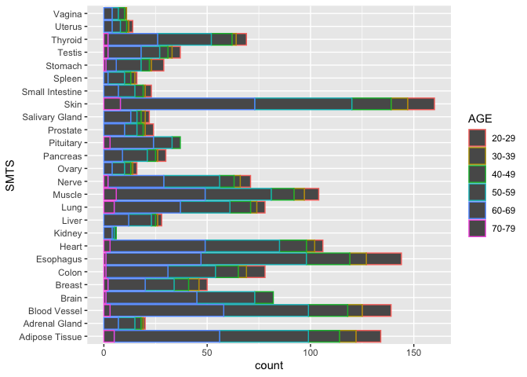
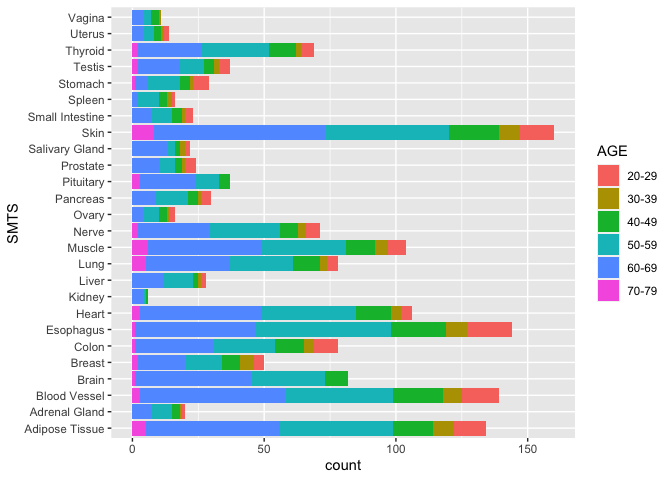
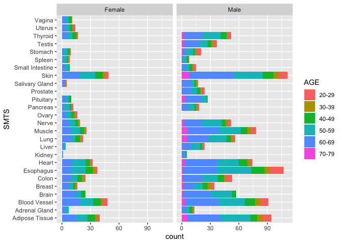
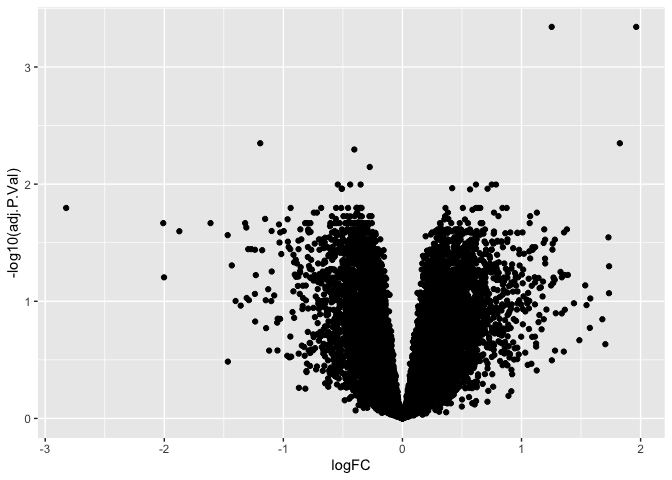
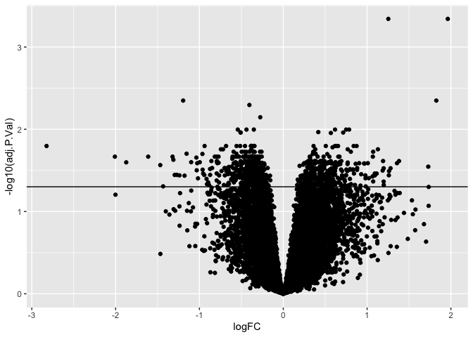
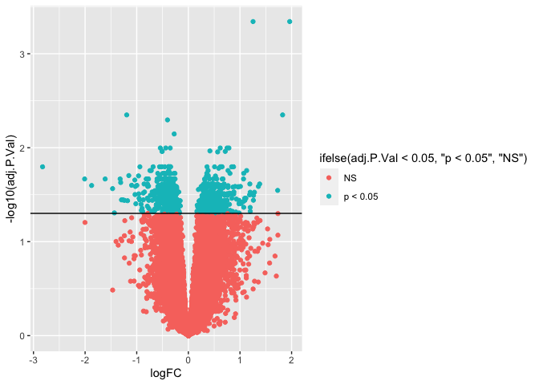
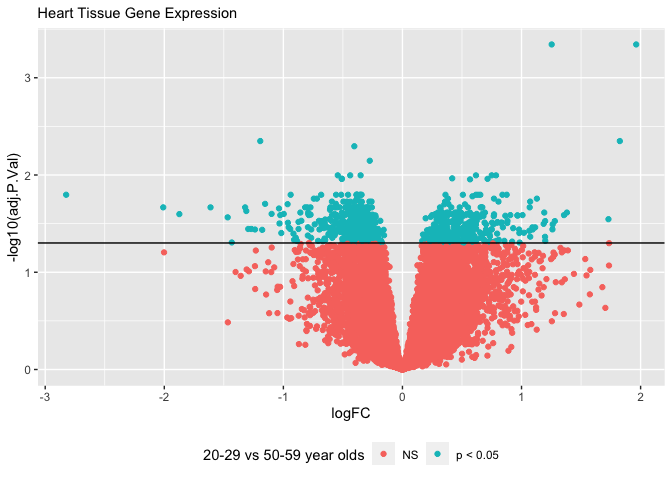
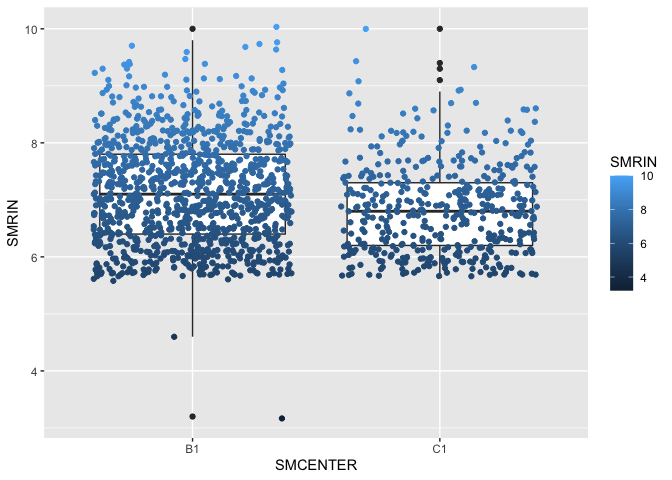

`ggplot2` is a very popular package for making visualization. It is
built on the “grammar of graphics”. Any plot can be expressed from the
same set of components: a data set, a coordinate system, and a set of
“geoms” or the visual representation of data points such as points,
bars, line, or boxes. This is the template we build on:
  
  ```
  ggplot(data = <DATA>, aes(<MAPPINGS>)) +
  <geom_function>() +
  ```

We just used the `count()` function to calculate how many samples are in
each group. The function for creating bar graphs (`geom_bar()`) also
makes use of `stat = "count"` to plot the total number of observations
per variable. Let’s use ggplot2 to create a visual representation of how
many samples there are per tissue, sex, and hardiness.

``` r
# Visualizing data with ggplot2

ggplot(samples, aes(x = SMTS)) +
  geom_bar(stat = "count")
```



In the last section, we will discuss how to modify the `themes()` to
adjust the axes, legends, and more. For now, let’s flip the x and y
coordinates so that we can read the sample names. We do this by adding a
layer and the function `coord_flip()`

``` r
ggplot(samples, aes(x = SMTS)) +
  geom_bar(stat = "count") + 
  coord_flip()
```



Now, there are two ways we can visualize another variable in addition to
tissue. We can add color or we can add facets.

Let’s first color the data by age bracket. Color is an aesthetic, so it
must go inside the `aes()`. If you include `aes(color = AGE)` inside
`ggplot()`, the color will be applied to every layer in your plot. If
you add `aes(color = AGE)` inside `geom_bar()`, it will only be applied
to that layer (which is important later when you layer multiple geoms.
               
               
               
``` r
head(samples)
ggplot(samples, aes(x = SMTS, color = AGE)) +
geom_bar(stat = "count") + 
coord_flip()
```
               


Note that the bars are outlined in a color according to hardy scale. If
instead, you would the bars “filled” with color, use the aesthetic
`aes(fill = AGE)`
               
``` r
ggplot(samples, aes(x = SMTS, fill = AGE)) +
geom_bar(stat = "count") + 
coord_flip()
```
               


Now, let’s use `facet_wrap(~SEX)` to break the data into two groups
based on the variable sex.
               
``` r
ggplot(samples, aes(x = SMTS, fill = AGE)) +
  geom_bar(stat = "count") + 
  coord_flip() +
  facet_wrap(~SEX)
```
               


With this graph, we have an excellent overview of the total numbers of
RNA-Seq samples in the GTEx project, and we can see where we are missing
data (for good biological reasons). However, this plot doesn’t show us
Hardy Scale. It’s hard to layer 4 variables, so let’s remove Tissue as a
variable by focusing just on one Tissue.
               
=== "Challenge"
               
    Create a plot showing the total number of samples per Sex, Age Bracket,
    and Hardy Scale for *just* the Heart samples. Paste the code you used in
    the chat.
               
=== "Answer"
               
     There are many options. Here are a few.
               
               ggplot(samples, aes(x = DTHHRDY, fill = AGE))  +
                 geom_bar(stat = "count") +
                 facet_wrap(~SEX) 
               
               ggplot(samples, aes(x = AGE, fill = as.factor(DTHHRDY)))  +
                 geom_bar(stat = "count") +
                 facet_wrap(~SEX) 
               

                 
One thing these plots show us is that we don’t have enough samples to
test the effects of all our experimental variables (age, sex, tissue,
and hardy scale) and their interactions on gene expression. We can,
however, focus on one or two variables or groups at a time.
               
Earlier, we imported the file “data/GTEx_Heart_20-29_vs_70-79.tsv”)” and
saved it as “results”. This file contains the results of a differential
gene expression analysis comparing heart tissue from 20-29 to heart
tissue from 30-39 year olds. This is a one-way design investigating only
the effect of age (but not sex or hardy scale) on gene expression in the
heart. Let’s visualize these results.

[Volcano Plots](https://en.wikipedia.org/wiki/Volcano_plot_(statistics))
are a type of scatter plots that show the log fold change (logFC) on the
x axis and the inverse log (`-log10()`) of a p-value that has been
corrected for multiple hypothesis testing (adj.P.Val). Let’s create a
Volcano Plot using the `gplot()` and `geom_point()`. *Note: this may
take a minute because there are 15,000 points that must be plotted*
  
``` r
ggplot(results, aes(x = logFC, y = -log10(adj.P.Val))) +
  geom_point() 
```

 

The inverse log of p \< 05 is 1.30103. We can add a horizontal line to
our plot using `geom_hline()` so that we can visually see how many genes
or points are significant and how many are not.

``` r
ggplot(results, aes(x = logFC, y = -log10(adj.P.Val))) +
  geom_point() +
  geom_hline(yintercept = -log10(0.05))
```

 

``` r
ggplot(results, aes(x = logFC, y = -log10(adj.P.Val))) +
  geom_point(aes(color = ifelse( adj.P.Val < 0.05, "p < 0.05", "NS"))) +
  geom_hline(yintercept = -log10(0.05)) 
```

 

``` r
ggplot(results, aes(x = logFC, y = -log10(adj.P.Val))) +
  geom_point(aes(color = ifelse( adj.P.Val < 0.05, "p < 0.05", "NS"))) +
  geom_hline(yintercept = -log10(0.05))  +
  theme(legend.position = "bottom") +
  labs(color = "20-29 vs 50-59 year olds", 
       subtitle = "Heart Tissue Gene Expression")
```

 

=== "Challenge"

    Create a volcano plot for the results comparing the heart tissue of
    20-29 year olds to that of 70-70 year olds? Are there more or less
    differential expressed gene between 20 and 30 year olds or 20 and 70
    year olds?
  
=== "Answer"

    ```
    df <- read.table("./data/GTEx_Heart_20-29_vs_70-79.tsv")
    
    ggplot(df, aes(x = logFC, y = -log10(adj.P.Val))) +
      geom_point() +
      geom_hline(yintercept = -log10(0.05))

    # more  
    ```


In addition to containing information about the donor tissue, the
samples file contains has a column with a RIN score, which tells us
about the quality of the data. If we wanted to look for interactions
between RIN score (SMRIN) and sequencing facility (SMCENTER), we can use
a box plot.

``` r
ggplot(samples, aes(x = SMCENTER, y = SMRIN)) +
  geom_boxplot() +
  geom_jitter(aes(color = SMRIN))
```

 

Now you know a handful of R functions for importing, summarizing, and
visualizing data. In the next section, we will tidy and transform our
data so that we can make even better summaries and figures. In the last
section, you will learn ggplot function for making fancier figures.

!!! info

    #### Key functions
    
     | Function       | Description                                                                                                                 |
       |----------------|-------------------------------------------------------------------------------------------------------------------------|
      | `ggplot2`      | An open-source data visualization package for the statistical programming language R                                    |
      | `ggplot()`     | The function used to construct the initial plot object, and is almost always followed by + to add component to the plot |
      | `aes()`        | Aesthetic mappings that describe how variables in the data are mapped to visual properties (aesthetics) of geoms        |
      | `geom_point()` | A function used to create scatter plots                                                                                 |
      | `geom_bar()`   | A function used to create bar plots                                                                                     |
      | `coord_flip()` | Flips the x and y axis                                                                                                  |
      | `geom_hline()` | Add a horizontal line to plots                                                                                          |
