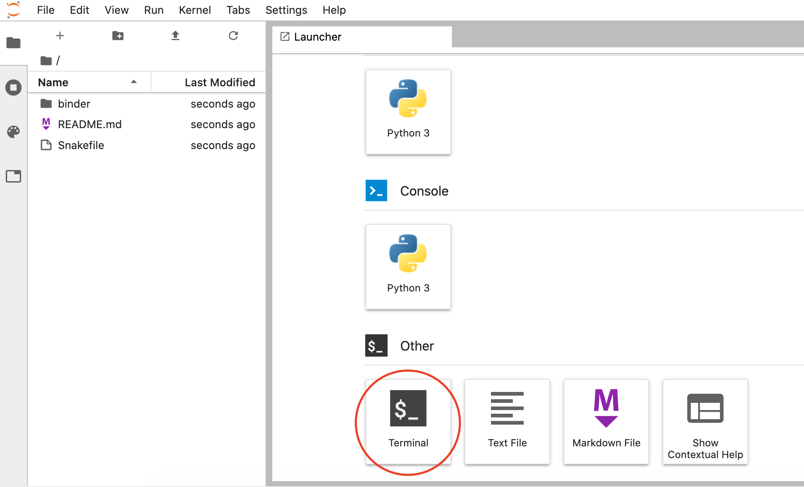
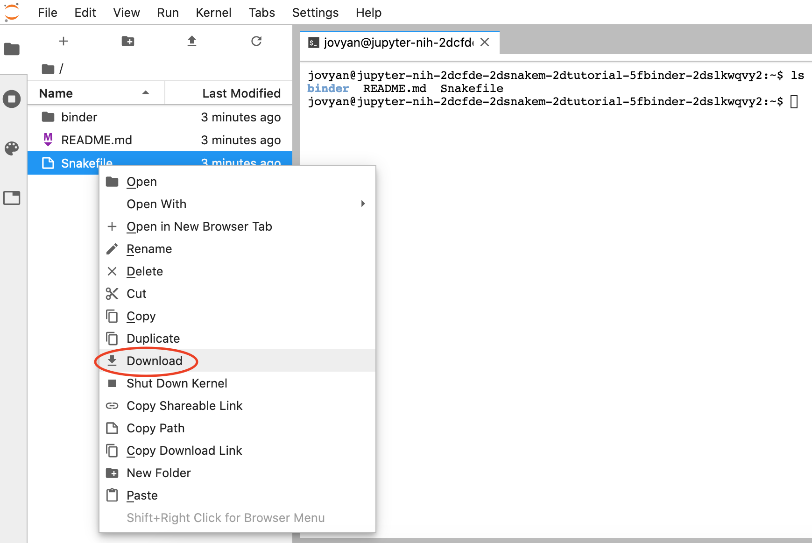
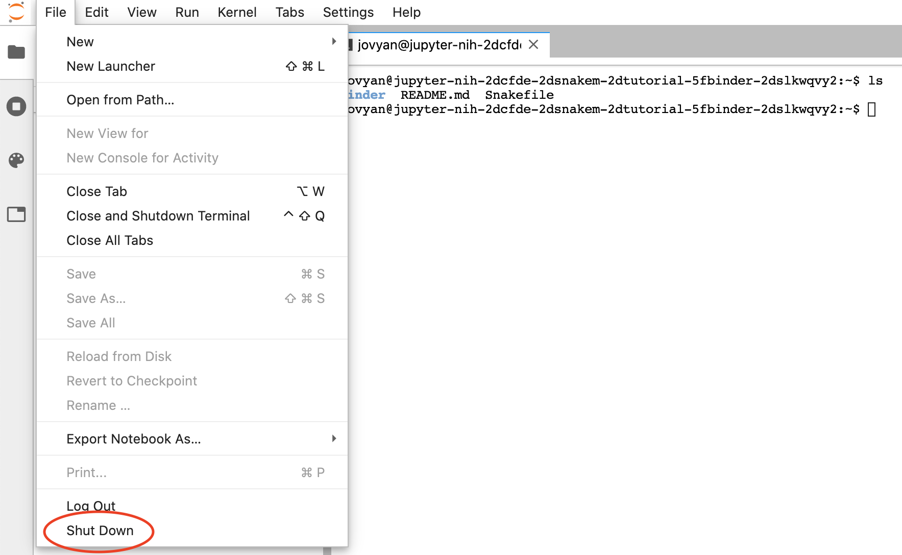

# Set Up

## Choose computing environment

There are two ways to follow this tutorial:

**A) Use the pangeo binder.** This is a good option if you don't have access to a Unix/Linux computer.

- Open the binder environment in a **new tab** (i.e., by typing ++ctrl++ and clicking link). It will take a few minutes to build:

    [Click me to launch binder!](https://binder.pangeo.io/v2/gh/nih-cfde/training-snakemake-binder/stable-binder){:target="_blank"}

- Click on the "Terminal" button to launch it:

    

- Then, follow the set up instructions below starting at **step 2**. The Snakefile and necessary conda environment files are already installed in the binder.

!!! warning
    When you close the binder, it does NOT save your work so download any files you want to keep.

- To download files, right-click the file you want to save, and select "Download":

    

- To close the binder, go to "File" and click "Shut Down":

    

!!! note

    We also have an Rstudio version of the binder environment. The only difference compared to the terminal binder environment is the layout of Rstudio panels. The template Snakefile and software are pre-loaded with the binder.

    [Click me to launch binder!](https://binder.pangeo.io/v2/gh/nih-cfde/training-snakemake-binder/rstudio-binder?urlpath=rstudio){:target="_blank"}


**B) Use a Unix or Linux environment (e.g., with a Mac or High Performing Computing environment).**

- For this option, please follow **all** the set up instructions below.

## Set up computing environment

We will use conda to create an computer software for this tutorial. If you don't have conda installed, please see the [Set up computing environment with conda on MacOS tutorial](../Introduction-to-Conda/install_conda_tutorial.md).

!!! Tip

    Please refer to the [conda command cheat sheet](../Cheat-Sheets/conda_cheatsheet.md) for commonly used conda commands!

### Step 1: Download tutorial files:

First, create a new directory for this tutorial in the `(base)` conda environment, e.g.,:

```
mkdir learn_snakemake
```

We need two files for this tutorial. Click the links and save them in the directory you created above: 1) [environment.yml](./snakemake_tutorial_docs/environment.yml) and 2) [Snakefile](./snakemake_tutorial_docs/Snakefile.py).

Rename the "Snakefile.py" to "Snakefile". There should be no file extension (we just added it so you'd be able to download the file!).

If you want to use `wget` to download them to a remote computer, these commands should work on most Linux systems:
```
wget https://training.nih-cfde.org/en/latest/General-Tools/Snakemake/snakemake_tutorial_docs/environment.yml
wget https://training.nih-cfde.org/en/latest/General-Tools/Snakemake/snakemake_tutorial_docs/Snakefile.py
mv Snakefile.py Snakefile
```

### Step 2: Create new conda environment:

conda is a software installation system that we will not cover in any
detail today, but it is how we install all of our software for this
lesson!  Please see our
[Introduction to Conda](../Introduction-to-Conda/index.md) for more
information.

The `environment.yml` file tells conda 1) where to look for the software installations under "channels" and 2) what software to install under "dependencies". You can also specify specific software versions, otherwise conda will download the most up-to-date version. Here are the specifications we'll use for this tutorial, as described in `environment.yml`:

channels (where the software will be installed from):

  - conda-forge
  - bioconda
  - defaults

dependencies (which software will be installed):

  - bwa
  - snakemake-minimal=6.3.0
  - samtools=1.10
  - bcftools

If you're using the pangeo binder, the steps below are already done for you;
if you are on a laptop or other computer, you can install all the
necessary software by running the following command:
```
conda env create -n snaketest -f environment.yml
```

This creates a new environment called `snaketest`, which you can then activate.


### Step 3: Activate conda environment:

To use the software you just installed, execute:
```
conda activate snaketest
```

Your terminal command prompt should now look like `(snaketest) $` instead of `(base) $`. This indicates that we can use all of the software installed by conda for this lesson.

### Step 4: Test that your environment is ready to go

You should have several software packages installed in your `snaketest` environment now. Check it out!

=== "Input"

    ```
    samtools --version
    ```

=== "Expected Output"

    ```
    samtools 1.10
    Using htslib 1.10.2
    Copyright (C) 2019 Genome Research Ltd.
    ```

If you get an error, the software installation may have failed. You can check the software that is installed in your conda environment: `conda list`

To leave the conda environment, type: `conda deactivate`

Later in the tutorial, we'll use `wget` to download data. Installing `wget` on MacOS can be achieved with `conda install`. This step will take a few minutes and the installation should be done in the `base` conda environment:

Go back to base environment:
```
conda deactivate
```

Install `wget`:
```
conda install -c conda-forge wget
```

Test installation:

=== "Input"

    ```
    wget --version
    ```

=== "Expected Output"

    ```
    GNU Wget 1.20.1 built on darwin14.5.0.

    -cares +digest -gpgme +https +ipv6 -iri +large-file -metalink -nls
    +ntlm +opie -psl +ssl/openssl

    Wgetrc:
        /Users/amanda/miniconda3/envs/snaketest/etc/wgetrc (system)
        Compile:
        x86_64-apple-darwin13.4.0-clang -DHAVE_CONFIG_H
        -DSYSTEM_WGETRC="/Users/amanda/miniconda3/envs/snaketest/etc/wgetrc"
        -DLOCALEDIR="/Users/amanda/miniconda3/envs/snaketest/share/locale"
        -I. -I../lib -I../lib -D_FORTIFY_SOURCE=2 -mmacosx-version-min=10.9
        -I/Users/amanda/miniconda3/envs/snaketest/include -DHAVE_LIBSSL
        -I/Users/amanda/miniconda3/envs/snaketest/include -DNDEBUG
        -march=core2 -mtune=haswell -mssse3 -ftree-vectorize -fPIC -fPIE
        -fstack-protector-strong -O2 -pipe
        -I/Users/amanda/miniconda3/envs/snaketest/include
        -fdebug-prefix-map=/opt/concourse/worker/volumes/live/c2196a4d-0070-4d98-71cc-9baa5fb53ac9/volume/wget_1551978005217/   work=/usr/local/src/conda/wget-1.20.1
        -fdebug-prefix-map=/Users/amanda/miniconda3/envs/snaketest=/usr/local/src/conda-prefix
    Link:
        x86_64-apple-darwin13.4.0-clang
        -I/Users/amanda/miniconda3/envs/snaketest/include -DHAVE_LIBSSL
        -I/Users/amanda/miniconda3/envs/snaketest/include -DNDEBUG
        -march=core2 -mtune=haswell -mssse3 -ftree-vectorize -fPIC -fPIE
        -fstack-protector-strong -O2 -pipe
        -I/Users/amanda/miniconda3/envs/snaketest/include
        -fdebug-prefix-map=/opt/concourse/worker/volumes/live/c2196a4d-0070-4d98-71cc-9baa5fb53ac9/volume/wget_1551978005217/work=/usr/local/src/conda/wget-1.20.1
        -fdebug-prefix-map=/Users/amanda/miniconda3/envs/snaketest=/usr/local/src/conda-prefix
        -Wl,-pie -Wl,-headerpad_max_install_names -Wl,-dead_strip_dylibs
        -Wl,-rpath,/Users/amanda/miniconda3/envs/snaketest/lib
        -L/Users/amanda/miniconda3/envs/snaketest/lib
        -L/Users/amanda/miniconda3/envs/snaketest/lib -lssl -lcrypto
        -L/Users/amanda/miniconda3/envs/snaketest/lib -lz ftp-opie.o
        openssl.o http-ntlm.o ../lib/libgnu.a -lcrypto

    Copyright (C) 2015 Free Software Foundation, Inc.
    License GPLv3+: GNU GPL version 3 or later
    <http://www.gnu.org/licenses/gpl.html>.
    This is free software: you are free to change and redistribute it.
    There is NO WARRANTY, to the extent permitted by law.

    Originally written by Hrvoje Niksic <hniksic@xemacs.org>.
    Please send bug reports and questions to <bug-wget@gnu.org>.
    ```
