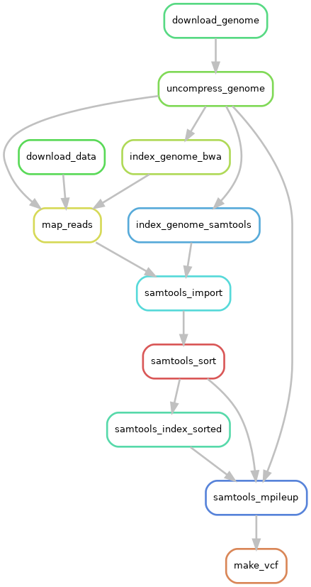

# Run the whole pipeline!

### Step 11: Running the pipeline

Once you've decorated the entire Snakefile, you should be able to run through the whole workflow using either the rule name:

```
snakemake -p make_vcf -j 2
```

or by using the file name:

```
snakemake -p variants.vcf -j 2
```

Recollect that Snakemake will execute the first rule in the Snakefile by default. We can use this feature by creating a default rule called `all` at the top of the Snakefile:

=== "Snakemake rule"

    ```
    rule all:

        input: "variants.vcf"
    ```

and run:

```
snakemake -p all -j 2
```

This rule runs through the entire workflow with a single command! This is much better than running each command one by one!

The final snakemake workflow looks like this:



!!! note

    The diagram above is called a directed acyclic graph (DAG) and it is how snakemake interprets the workflow from the Snakefile. You can read more about the syntax information on the [snakemake documentation](https://snakemake.readthedocs.io/en/stable/tutorial/basics.html#step-4-indexing-read-alignments-and-visualizing-the-dag-of-jobs).

    To generate a DAG file, we need `Graphviz`, a graph visualization software, and `dot` to create directed graphs. We can use conda to create a new environment with the required packages.

    ```
    # initialize and reset the bash with conda
    conda init bash
    source .bashrc

    # create a new environment and install Graphviz
    conda create -y -n graphs graphviz

    # activate conda environment
    conda activate graphs

    # create dag png file
    snakemake --dag variants.vcf | dot -Tpng > vc_workflow_dag.png
    ```

### Step 12: Looking at VCF files

Finally, let's look at the output!

```
less variants.vcf
```

We can look at the alignment by running the [alignment viewer](http://samtools.sourceforge.net/tview.shtml) in samtools:
```
samtools tview -p ecoli:4202391 SRR2584857.sorted.bam ecoli-rel606.fa
```

!!! tip "Navigating samtools tview"
    - Access the help menu in `samtools tview` by hitting `shift` key and `?` key.
    - Exit help menu by hitting `q` key
    - Go to a specific position location in the alignment by hitting `/` key.

## Conclusion

Exit `(snaketest)` conda environment to return to `(base)` environment:

```
conda deactivate
```

Hopefully, you have now:

- learned how to write basic workflows with Snakemake rules
- learned variable substitution for Snakemake rules
- learned wildcard matching for Snakemake rules
- understood why workflow systems can help you do your computing more easily!

!!! note "Key Points"

    - Snakefile defines a Snakemake workflow
    - the rules specify steps in the workflow
    - at the moment (and in general), they run shell commands
    - you can "decorate" the rules to link the dependencies between rules
    - basic decoration comes in the form of `input:` and `output:` which are lists of one or more files, quoted, separated by commas
    - the rules are connected by matching filenames
    - tabs are important syntax feature in Snakemake
