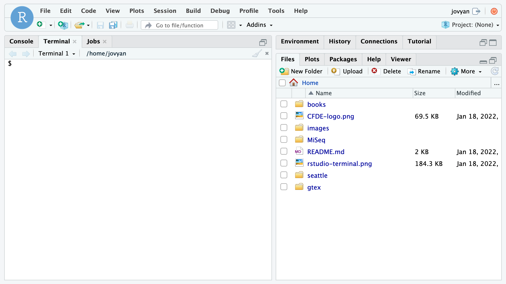

# The shell and terminal

The **shell** is a computer program that uses a command-line interface (CLI) to give commands made by your keyboard to your operating system. Most people are used to interacting with a graphic user interface (GUI), where you can use a combination of your mouse and keyboard to carry out commands on your computer. 

We can use the shell through a **terminal** program. From the terminal, we can open programs, run analyses, create documents, delete files, and create folders. 

For this remote workshop, we will be using a custom-created computing environment using [Binder](https://mybinder.org/). Click the **launch binder** button below, wait for it to launch, then open a new terminal window by clicking **Terminal**.

[](https://mybinder.org/v2/gh/nih-cfde/training-rstudio-binder/data?urlpath=rstudio)





To help with readability, type `PS1='$ '` in the terminal to remove the very long computer name from the path. Then type `clear` to clear the screen of irrelevant warning messages. 

```
PS1='$ '
clear
```

Why use Binder and RStudio? We like it for several reasons. With Binder, we can create custom computing environments that can be used by the instructor and the learners. This means we don't have to worry about differences between Mac, PC, and UNIX computers or admin permissions. Additionally, RStudio has a  graphical interface that shows the filesystem, unlike most command-line terminal programs.  

For today's lesson, we will focus on four different sets of data. `books` contains ebooks such as A Tale of Two Cities and The Wizard of Oz that were downloaded from [Project Gutenberg](https://www.gutenberg.org/ebooks/).  .`southpark` contains a compressed .csv file containing all the lines spoken by each character across 14 seasons. `seattle` contains data from the Open Seattle Data Portal, including a csv file with names of pets.  The `MiSeq` directory contains FASTQ and FASTA files that are associated with the [Mauther software tutorial](https://mothur.org/wiki/miseq_sop/). These data are useful for practicing commonly used UNIX commands to explore genome-scale data. 

During this lesson, we use UNIX commands to answer questions following motivating questions.

* What is the title of Chapter 1 of each book?
* Which ebook contains the most lines of text? 
* How many R1 and R2 reads were generated from each MiSeq sample?  
* Do our results match the reported results? 
* Which South Park character spoke the most lines?

!!! note "Key Points"

	* A shell is a program that reads commands and runs programs
	* We are using a remote computing environment provided by <myBinder.org>