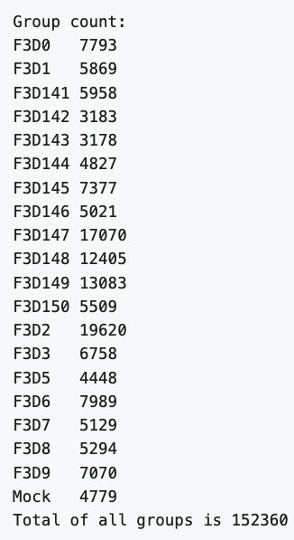

# Redirection and for loops

If you did the last challenge, you saw that the **images/** directory contains a file called **MiSeq-readcount-Mothur.png**. This image is a screenshot from the [Mauther software tutorial](https://mothur.org/wiki/miseq_sop/) showing the count or number of reads for each sample. 




To see if our data matches theirs, we can count the number of lines in the .fastq files with the UNIX command `wc`. This will print by default the number of characters, words, and lines in a file. We can ask for just the number of lines with the `-l`  option. 


=== "Input"
	
	```
	wc -l *fastq
	```


=== "Expected Output"


	```
	31172 F3D0_S188_L001_R1_001.fastq
    31172 F3D0_S188_L001_R2_001.fastq
    23832 F3D141_S207_L001_R1_001.fastq
    23832 F3D141_S207_L001_R2_001.fastq
    12732 F3D142_S208_L001_R1_001.fastq
    12732 F3D142_S208_L001_R2_001.fastq
    12712 F3D143_S209_L001_R1_001.fastq
    12712 F3D143_S209_L001_R2_001.fastq
    19308 F3D144_S210_L001_R1_001.fastq
    19308 F3D144_S210_L001_R2_001.fastq
    29508 F3D145_S211_L001_R1_001.fastq
    29508 F3D145_S211_L001_R2_001.fastq
    20084 F3D146_S212_L001_R1_001.fastq
    20084 F3D146_S212_L001_R2_001.fastq
    68280 F3D147_S213_L001_R1_001.fastq
    68280 F3D147_S213_L001_R2_001.fastq
    49620 F3D148_S214_L001_R1_001.fastq
    49620 F3D148_S214_L001_R2_001.fastq
    52332 F3D149_S215_L001_R1_001.fastq
    52332 F3D149_S215_L001_R2_001.fastq
    22036 F3D150_S216_L001_R1_001.fastq
    22036 F3D150_S216_L001_R2_001.fastq
    23476 F3D1_S189_L001_R1_001.fastq
    23476 F3D1_S189_L001_R2_001.fastq
    78480 F3D2_S190_L001_R1_001.fastq
    78480 F3D2_S190_L001_R2_001.fastq
    27032 F3D3_S191_L001_R1_001.fastq
    27032 F3D3_S191_L001_R2_001.fastq
    17792 F3D5_S193_L001_R1_001.fastq
    17792 F3D5_S193_L001_R2_001.fastq
    31956 F3D6_S194_L001_R1_001.fastq
    31956 F3D6_S194_L001_R2_001.fastq
    20516 F3D7_S195_L001_R1_001.fastq
    20516 F3D7_S195_L001_R2_001.fastq
    21176 F3D8_S196_L001_R1_001.fastq
    21176 F3D8_S196_L001_R2_001.fastq
    28280 F3D9_S197_L001_R1_001.fastq
    28280 F3D9_S197_L001_R2_001.fastq
    19116 Mock_S280_L001_R1_001.fastq
    19116 Mock_S280_L001_R2_001.fastq
  	1218880 total
	```

However, this number is too large. In fact, it is 4 times larger than the number of reads. To capture just the number of reads, we can first use `grep` followed `wc`.


By default, many UNIX commands like `cat` send output to something called
standard out, or "stdout". This is a catch-all phrase for "the basic
place we send regular output." (There's also standard error, or "stderr",
which is where errors are printed; and standard input, or "stdin", which
is where input comes from.)

Much of the power of the UNIX command line comes from working with
stdout output, and if you work with UNIX a lot, you'll see characters
like the `>` (redirect), `>>` (append) , and `|` (pipe). These
are redirection commands that say, respectively, "send stdout to a new
file", "append stdout to an existing file", and "send stdout from one
program to another program's stdin."

If you know you want to save an output file, you can use the redirect symbol `>`. Note, if you want to save a file in a different directory, that directory must exist. We can go to our MiSeq directory and try it.


Let's now use grep to match the first line, which starts with "@M00967", of all the R1 files then pipe the output to wc and count the number of liens. 

=== "Input"

	```
	head -n 1 *.fatsq
	grep "^@M00967" *R1*.fastq | wc -l
	```

=== "Expected Output"

	The answer, 152883, matches the authors. Nice. Also, we just scanned many large files very quickly to confirm a finding. 

	```
	152883

	```

You probably don't want to read all the lines that were matched, but piping the output to head is a nice way to view the first 10 lines. 

=== "Input"
	
	```
	grep "^@M00967" *R1*.fastq  | head
	```
	
=== "Expected Output"	

	The result looks like the following. The error message at the end is as expected, and happens after the specified number of lines are printed.  

	```
	F3D0_S188_L001_R1_001.fastq:@M00967:43:000000000-A3JHG:1:1101:18327:1699 1:N:0:188
	F3D0_S188_L001_R1_001.fastq:@M00967:43:000000000-A3JHG:1:1101:14069:1827 1:N:0:188
	F3D0_S188_L001_R1_001.fastq:@M00967:43:000000000-A3JHG:1:1101:18044:1900 1:N:0:188
	F3D0_S188_L001_R1_001.fastq:@M00967:43:000000000-A3JHG:1:1101:13234:1983 1:N:0:188
	F3D0_S188_L001_R1_001.fastq:@M00967:43:000000000-A3JHG:1:1101:16780:2259 1:N:0:188
	F3D0_S188_L001_R1_001.fastq:@M00967:43:000000000-A3JHG:1:1101:19378:2540 1:N:0:188
	F3D0_S188_L001_R1_001.fastq:@M00967:43:000000000-A3JHG:1:1101:17674:2779 1:N:0:188
	F3D0_S188_L001_R1_001.fastq:@M00967:43:000000000-A3JHG:1:1101:18089:2781 1:N:0:188
	F3D0_S188_L001_R1_001.fastq:@M00967:43:000000000-A3JHG:1:1101:14203:2907 1:N:0:188
	F3D0_S188_L001_R1_001.fastq:@M00967:43:000000000-A3JHG:1:1101:19561:3147 1:N:0:188
	grep: write error: Broken pipe
```


To count the number of reads in each file, we could `grep` each file individually, but that would be prone to errors.


```
grep "^@M00967" F3D0_S188_L001_R1_001.fastq | wc -l
grep "^@M00967" F3D0_S188_L001_R1_001.fastq | wc -l
grep "^@M00967" F3D142_S208_L001_R1_001.fastq | wc -l

```


If we want to know how many times it occurs in each in each file, we need a for loop. A for often loop looks like this:

```
for [thing] in [list of things]
do
echo $[thing]
command $[thing]
done
```


To answer the question, how many reads are in each R1 file, we can construct the following for loop. 

=== "Input"

	```
	for file in *R1*fastq
	do
	echo $file
	grep "^@M00967" $file | wc -l
	done
	```
	
=== "Expected Output"	

	This gives the following result, which matches the authors

	```
	F3D0_S188_L001_R1_001.fastq
	7793
	F3D141_S207_L001_R1_001.fastq
	5958
	F3D142_S208_L001_R1_001.fastq
	3183
	...
	F3D8_S196_L001_R1_001.fastq
	5294
	F3D9_S197_L001_R1_001.fastq
	7070
	Mock_S280_L001_R1_001.fastq
	4779
	```

Let's practice.


=== "Exercise"

	How many genes are in the yeast genome?

=== "Input"

	If you did a previous exercise with `find` you saw a file called yeast.fasta in the books directory. You can use `wc` to count the lines beginning with `>` to calculate the genome size. 

	```
	cd ~/books
	grep "^>" yeast.fasta | wc -l
	```

=== "Expected Output"

	```
	6600
	```
!!! note "Key Points"

	|Command|Description|
	|-|- |
	| `wc` [filename] | print the total characters, words, and lines in a file |
	| `|` | redirect the output to another program |
	| `>` | redirect the output to a file |
	| `>>` | append the output to a file |