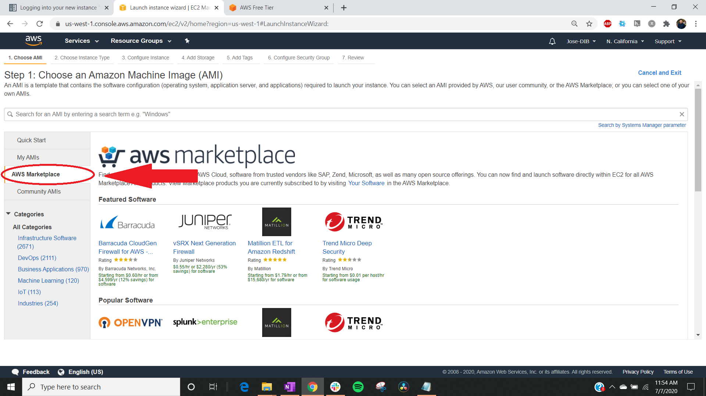

## Step 1: Create and Log into an AWS Account

Go to [Amazon Web Services](https://aws.amazon.com) in a Web browser.

Select 'My Account' menu option 'AWS Management Console."

Log in with your username & password.

!!! Note

          If you need to create an account, please follow these instructions. <https://aws.amazon.com/premiumsupport/knowledge-center/create-and-activate-aws-account/>

!!! Warning
    If you are creating an account, then the account could take up to 24 hours to activate.

Check to make sure the location that corresponds to your actual location is correct. 
For me, it is US West (N. California).

## Step 2: Run an Instance

Click on `Services` (upper left).

Click on `EC2`.

Click on `Launch Instance`.

!!! Note
         Amazon Elastic Cloud Computing features virtual computing environments called instances. These instances can vary in configurations of CPU, memory, storage, networking capacity.
         For the purposes of future tutorials, we will launch Ubuntu 20.04 Pro LTS. LTS releases are the ‘enterprise grade’ releases of Ubuntu and are utilised the most. 

Select `AWS Marketplace` on the left hand side tab

Type `Ubuntu 20.04 Pro LTS` on the search bar underneath

Step 1: Choose an Amazon Machine Image (AMI)

An Amazon Machine Image is a special type of virtual appliance that is used to create a virtual machine within the Amazon Elastic Compute Cloud. It is a template for the root volume of an instance (operating system, application server, and applications.)

Select `Ubuntu Server 20.04 Pro LTS (HVM)`.

!!! Note
    The Free Tier Eligible tag lets us know that this particular operating system is covered by the Free Tier program where you use the service with limits without being charged. Limits could be based on how much storage you can use and how many hours you can use in one month.

Step 2: Choose an Instance Type

Amazon EC2 provides a wide selection of instance types optimized to fit different use cases. Instances are virtual servers that can run applications. They have varying combinations of CPU, memory, storage, and networking capacity, and give you the flexibility to choose the appropriate mix of resources for your applications. Learn more about instance types and how they can meet your computing needs.

Select `t2 micro`.

Click `Continue`.

!!! Note
    
    You may skip steps 3-6 as it is 

Steps 3: Configure Instance

Configure the instance to suit your requirements. You can launch multiple instances from the same AMI, request Spot instances to take advantage of the lower pricing, assign an access management role to the instance, and more.

!!! Note
    A Spot Instance is an unused EC2 instance that is available for less than the On-Demand price. Because Spot Instances enable you to request unused EC2 instances at steep discounts, you can lower your Amazon EC2 costs significantly.

Step 4: Add Storage

Your instance will be launched with the following storage device settings. You can attach additional EBS volumes and instance store volumes to your instance, or edit the settings of the root volume. You can also attach additional EBS volumes after launching an instance, but not instance store volumes. Learn more about storage options in Amazon EC2.

Step 5: Add Tags

A tag consists of a case-sensitive key-value pair. For example, you could define a tag with key = Name and value = Webserver.
A copy of a tag can be applied to volumes, instances or both.
Tags will be applied to all instances and volumes. Learn more about tagging your Amazon EC2 resources.

Step 6: Configure Security Groups

A security group s a set of firewall rules that control the traffic for your instance. On this page you can add rules to allow specific traffic to reach your instance. You can create a new security group or select from an existing one.

### First Time Through (generate a new key pair)

If you do not have any key pairs, enter a key pair name and then download a key pair. Then click Launch Instance

!!! Note

    **Why do I need a key pair?**
    Easy Answer: *Security*. 

    The SSH (Secure Shell) protocol uses encryption to secure the connection between a client and a server. All user authentication, commands, output, and file transfers are encrypted to protect against attacks in the network. With SSH protocol (secure Shell) public key authenticantion improves security as it frees users from remembering complicated passwords.

### Next time through (select an existing key pair)

Select a key pair and click 'Launch Instances'.

## Click on View Instances

* After you click 'Launch Instance', you should see this:

* Click on this first hyperlink: i-038c58bfbe9612c57. Your hyperlink may not be exactly the same. 

## Select the public DNS name for later use

Highlight and copy the Public DNS address or write it down for future steps. This is highly important for connecting to an instance.

