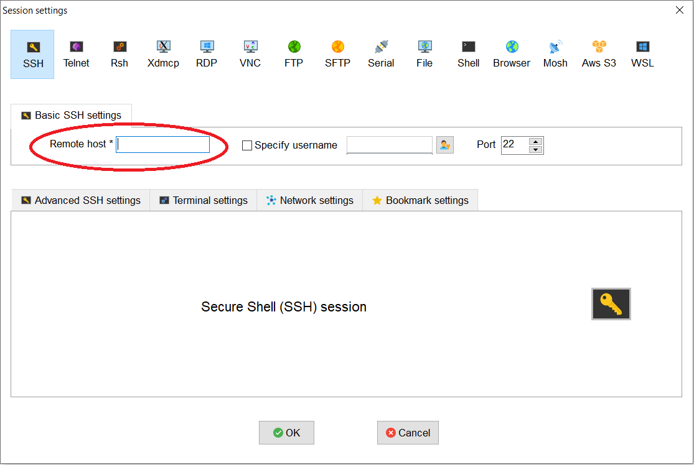
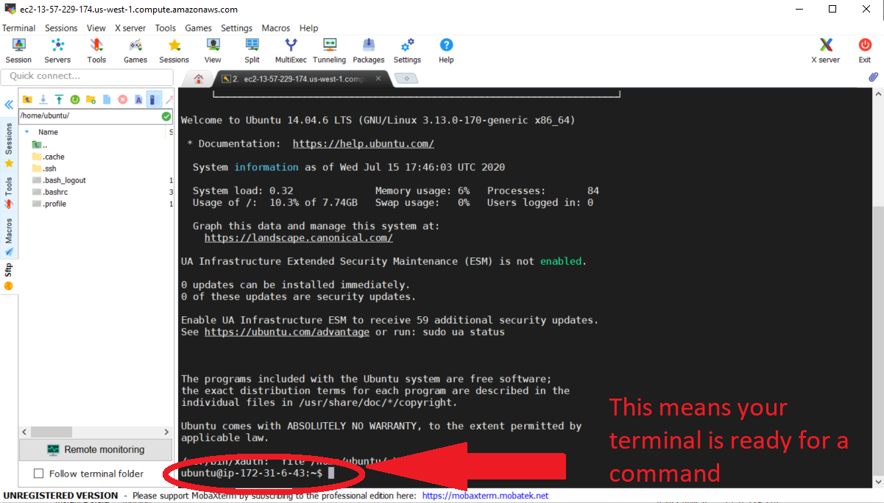

# Connect to your Instance

=== "Windows Instruction"

    Ok, so you've created a running computer. How do you get to it?

    The main thing you'll need is the network name of your new computer. To retrieve this, go to the [AWS instance view](https://us-east-2.console.aws.amazon.com/ec2/v2/home?region=us-east-2#Instances:sort=instanceId), click on the instance, and find the "Public DNS". This is the public name of your computer on the internet.

    ## Step 1: Open MobaXTerm

    [MobaXTerm](https://mobaxterm.mobatek.net/) is a terminal for Windows with an X11 server, a tabbed SSH client and several other network tools for remote computing (VNC, RDP, telnet,rlogin).

    MobaXterm brings all the essential Unix commands to Windows desktop, in a single portable exe file which works out of the box. You can download the [Home Edition](https://mobaxterm.mobatek.net/download.html) for free.

    ## Step 2: Start a new session

    

    

    ## Step 3: Set up session settings

    ### Specify the session key

    Enter the public DNS address from the [AWS instance](https://us-east-2.console.aws.amazon.com/ec2/v2/home?region=us-east-2#Instances:sort=instanceId) page in the "Remote host" box. It will look something like this: `ec2-XXX-YYY-AAA.compute-1.amazon.aws.com`. Enter `ubuntu` for "Specify username".

    

    Under "Advanced SSH settings", check the box by "Use private key" and search for the path to your "amazon.pem" key pair file/

    

    Click "OK" to complete session set up.

    If you see this screen and `ubuntu@ip-###-##-#-##:~$` as the command prompt, your AWS instance computer is ready for use!

    

    You can now use the AWS instance to run command line programs and run analyses. With MobaXterm, you can transfer files between your local computer and the remote instance by dragging and dropping files between MobaXterm's "SCP" tab (located on the left-hand side of the MobaXterm window) and your local computer's file explorer.

    

    

    ## Step 4: Terminating the Instance

    Once you have completed your tasks and are sure you do not need the instance any longer, you may terminate the instance by returning to [AWS Management Console](.

    !!! Warning

            If you simply close the MobaXterm terminal, the instance will continue to run and incur cost; it has not been terminated. You must go the instance on the AWS webpage to terminate it. Terminating an instance will erase all the work you have done on the instance! Be sure to download files from the remote instance to your local computer or other storage space before terminating the instance.

    - Click on "Services"
    - Click "EC2"
    - Click "Instance" on the left hand side bar menu and it should bring you to the list of running instances on your account.
    - Click on the instance you would like to terminate
    - Click "Actions"
    - Click "Instance State"
    - Select "Terminate"

    


=== "Mac OS"

    Ok, so you've created a running computer. How do you get to it?

    The main thing you'll need is the network name of your new computer. To retrieve this, go to the [AWS instance view](https://us-east-2.console.aws.amazon.com/ec2/v2/home?region=us-east-2#Instances:sort=instanceId), click on the instance, and find the "Public DNS". This is the public name of your computer on the internet.

    ## Step 1: Locate private key

    Find the private key file; it is the .pem file you downloaded when starting up the EC2 instance. We called it "amazon.pem". It should be in your Downloads folder. Move it onto your desktop.

    ## Step 2: Login to remote instance

    Start Terminal and change the permissions on the .pem file for security purposes (removes read, write, and execute permissions for all users except the owner (you)):
    ```
    chmod og-rwx ~/Desktop/amzon.pem
    ```

    Connect to remote instance:
    ```
    ssh -i ~/Desktop/amazon.pem ubuntu@ ec2-???-???-???-???.compute-1.amazonaws.com
    ```
    where `ec2-???-???-???-???.compute-1.amazonaws.com` is the Public DNS we copied earlier.


    ## Step 3: Transferring Files

    ### Copying files from remote instance to local computer

    - To use `scp` (secure copy) with a key pair use the following command:

    ```
    scp -i /directory/to/amazon.pem ubuntu@ec2-xx-xxx-xxx.compute-1.amazonaws.com:path/to/file /your/local/directory/files/to/download
    ```

    - You may also download a file from the remote instance download folder by archiving it:

    ```
    zip -r squash.zip /your/ec2/directory/
    ```

    - You can download all archived files from the remote instance by entering:

    ```
    scp - i/directory/to/amazon.pem ubuntu@ec2-xx-xx-xxx-xxx.compute-1.amazonaws.com:~/* /your/local/directory/files/to/download
    ```

    ### Copying files from local computer to remote instance

    - Your private key must not be publicly visible. Run the following command so that only the root user can read the file:

    ```
    chmod 400 amazon.pem
    ```

    - To use `scp` with a key pair use the following command:

    ```
    scp -i /directory/to/amazon.pem /your/local/file/to/copy ubuntu@ec2-xx-xx-xxx-xxx.compute-1.amazonaws.com:path/to/file
    ```

    !!! note

            You need to make sure that the user "user" has the permission to write in the target directory. In this example, if ~/path/to/file was created by you, it should be fine.


    ## Step 4: Terminating the Instance

    Once you have completed your tasks and are sure you do not need the instance any longer, you may terminate the instance by returning to [AWS Management Console](https://us-east-2.console.aws.amazon.com/ec2/v2/home?region=us-east-2#Instances:sort=instanceId)


    !!! warning

            If you simply close the MobaXterm terminal, the instance will continue to run and incur cost; it has not been terminated. You must go the instance on the AWS webpage to terminate it. Terminating an instance will erase all the work you have done on the instance! Be sure to download files from the remote instance to your local computer or other storage space before terminating the instance.

    - Click on "Services"
    - Click "EC2"
    - Click "Instance" on the left hand side bar menu and it should bring you to the list of running instances on your account.
    - Click on the instance you would like to terminate
    - Click "Actions"
    - Click "Instance State"
    - Select "Terminate"

    
