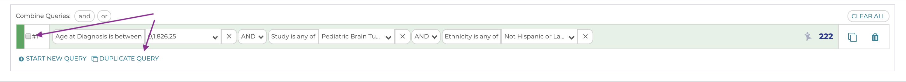

Combined Queries
===================================

What if our research question was whether children diagnosed with the
same brain tumors have significantly different clinical presentations
based on their age at diagnosis, and we want to compare very young
children to teens.

To do this, we would want to add a second filter for "Age at
diagnosis" for 15-20 year olds. However, we can't click on that bar in
the plots, and we also don't have the option to add a second version of
that filter in the Filters, we can only change the age range of the one
we have.

To build this more complex cohort, we need to make a combined query.

Step 1 Duplicate the Query
--------------------------

To make a copy of our query line we can either:

Push the copy button at the end of the query line we want to duplicate,
indicated with the purple arrow below:

Or you can choose any number of queries to duplicate simultaneously. To
do this, click the checkbox at the left side of each query you want to
duplicate, and then click the `duplicate query` button:

Since we only have one query to duplicate, these function identically.
However, if we had many queries and wanted to duplicate more than one of
them, the second way is a bit easier. Regardless of which method you
chose, you should now have two queries that are identical:

Step 2 Edit the age range in one query
--------------------------------------

In query 2, edit the `Age at Diagnosis` to be 15-20 years of age.

By clicking on each query, you should see that the title for the Cohort
Results and the plots change to match the query you have highlighted:

 AND vs OR

Step 3 Combine the Queries
--------------------------

Our two queries are each giving us results we want, now we need to
combine them into a single cohort. To do that, we use the checkboxes on
the left side of each query to select the ones we want to combine, and
then click the `or` above the left side of the queries:

Step 4 View Combined Query
--------------------------

We now have a new `Query #3` that includes individuals from
either of our two original queries:

