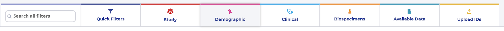

Filter Buttons
==============

<!--<a href="https://github.com/nih-cfde/training-and-engagement/blob/jeremyfixes/docs/images/KidsFirstPortal_14.png" data-lightbox="example-1" data-title="Exploring data filters">image #1</a>-->

To use the filter buttons, click on one, choose from the options in that
button, and click `apply`.

??? Exercise "Use the `Clinical` button to filter the data to include only samples where the patient was between 0 and 5 years old when they were diagnosed. CLICK HERE FOR ANSWER"

    Click `Clinical` then `Age at Diagnosis`. Choose
    `between` in the first dropdown, check `year` in
    the middle, and then type the numbers 0 in the `from` box
    and 5 in the `to` box. Click `Apply`.

If you applied this filter successfully, you should see something like
    the following:

Several things about the page have now changed. First, there is now
information in our queries box.

<!--  -->

<!-- 
**(<a href="../../../images/KidsFirstPortal_16.png">see full-size image</a>)** -->

It now says what query we are currently looking at, and how many
participants are in our query. Note that it says we chose ages between 0
and 1826.25, which means it automatically calculated 0-5 years in days.
