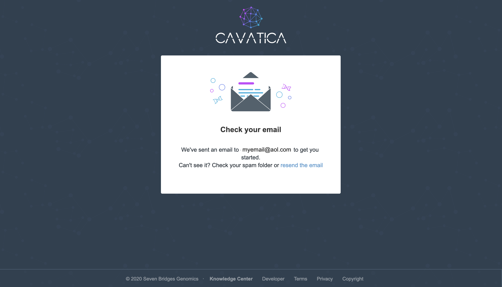

Register for Accounts
=====================

Ultimately, our goal is to analyze existing Kids First data in new ways,
or in new combinations, in order to improve medical outcomes. However,
before we can start using the data, we need to do a lot of set up.

Why so much setup?
------------------

As you likely know, there are many rules and regulations about who can
use human derived medical data, and for what purposes. Human genomic
data is no exception. Even if the human data you intend to use is
'open', that generally doesn't mean you can do anything you want with
it, just that there are fewer barriers to seeing it. Data curators like
the Kids First DRC are obligated to enforce access controls and data use
rules to the best of their ability, and that requires end users like us
to have accounts that are tied to verified identities.

Genomic data is also extremely large and unwieldy. For example, the Kids
First DRC maintains Whole Genome Sequences (WGS) and/or RNAseq data for
over 12,000 individuals. One type of file that stores genomic data like
this is called a bam file: a 	**B**inary sequence
**A**lignment **M**ap format file. We'll talk more
about file types later, but what is important here is that a bam file is
the smallest way to store alignment data. A bam file for RNAseq from one
individual typically ranges from 15 to 30 *gigabytes*, while a WGS bam
file for one individual can be as many as 350GB. This is not to mention
all of the files that go with each bam file in order to make them
useable for analysis. As of early 2020, the Kids First overall dataset
is 1.31 *petabytes*. Since there is so much data, it needs to live in a
huge, dedicated compute space, and running an analysis generally
requires much more memory and storage than is available on an office
computer.

Kids First uses their portal as a sort of catalog of their datasets, but
the data stored in Cavatica, a platform for doing data analysis in the
cloud. As such, at a minimum, we will need accounts for the Kids First
DRC Portal and Cavatica in order to do an analysis.

### Register for the Kids First DRC Portal

#### Step 1 Go to the portal website

First, we'll set up our accounts at the Kids First DRC Portal by going
to this link:

[https://portal.kidsfirstdrc.org/](https://portal.kidsfirstdrc.org/)

!!! Tip

    Open the link in a new tab by right clicking the link and selecting
    `open in a new tab`; or by holding `command` while you
    click the link (MacOS); or by holding `Ctrl` while you click
    the link (Windows)

#### Step 2 Click the Join link

This should take you to the Kids First Portal website. Please click on
the `Join now` indicated with the purple arrow below:

#### Step 3 Choose your login system

You should see three options for creating a new account: Google,
Facebook, or with an ORCID:

!!! Tip

    While you will be able to explore data in the portal regardless of which
    mechanism you choose, moving data to Cavatica and doing research
    requires that you have the proper authorization to view and use human
    data, even if that data is officially 'open'. Therefore we want to set
    up our account using our ORCID.

#### Step 4 Connect your ORCID

Clicking on `Log in with ORCID` will take you to a login
page:

Depending on your role, your ORCID may be personal, or tied to an
institution. If you don't already have an ORCID, you can also register
for one on [this page](https://orcid.org/register).

!!! Tip

    New ORCIDs

    If you are registering for an ORCID today, be sure to choose
    `Everyone` or `Trusted Parties` in the
    Visibility settings. You can always change this setting later, but you
    won't be able to link your ORCID account to the Kids First DRC portal
    if you choose `Only me`

!!! Error

    Error with existing ORCIDs

    If you already have an ORCID, and are getting a login error, then you
    will need to change your ORCID Visibility settings. To do this, go to
    <https://orcid.org/account> and edit your Visibility settings to
    `Everyone` or `Trusted Parties`

#### Step 5 Go back to the Portal

Once you have signed in with your ORCID, you should be re-directed back
to the Kids First DRC Portal and automatically logged in.

### Register for Cavatica

#### Step 1 Go to the Cavatica website

First, we'll set up our accounts at Cavatica by going to this link:

[https://cavatica.squarespace.com/](https://cavatica.squarespace.com/)

!!! Tip

    Open the link in a new tab by right clicking the link and selecting
    'open in a new tab'; or by holding `command` while you
    click the link (MacOS); or by holding `Ctrl` while you click
    the link (Windows)

#### Step 2 Click the Access Data link

That should have taken you to the Kids First and Cavatica Welcome page.
Scroll to the bottom and click on the `Access Data`.

#### Step 3 Click the Account Creation link

As with Kids First, Cavatica offers multiple ways to log in: eRA Commons
ID or a user name and password. Since we don't yet have accounts, we
need to register, by clicking `New to Cavatica? Create an
account`indicated with the purple arrow below:

#### Step 4 Choose your login system

You should now have the option to continue using an eRA Commons ID, or
by setting up a user name and password.

-   If you have an eRA Commons ID, choose `login with with eRA
    Commons` and log in using your credentials.
-   If you don't have an eRA Commons ID, choose `Continue with email
    and password` and then fill out the form and click
    `Register`.

!!! Important

    While you will be able to explore data in the Cavatica regardless of
    which mechanism you choose, moving data from Kids First and doing
    research requires that you have the proper authorization to view and use
    human data, even if that data is officially 'open'. If you have one,
    you should opt to login using your eRA Commons ID.

#### Step 5 Click the email link

Once your registration is complete, you should get a prompt to go check
your email:

You will need to follow the link in that email to complete your
registration.
