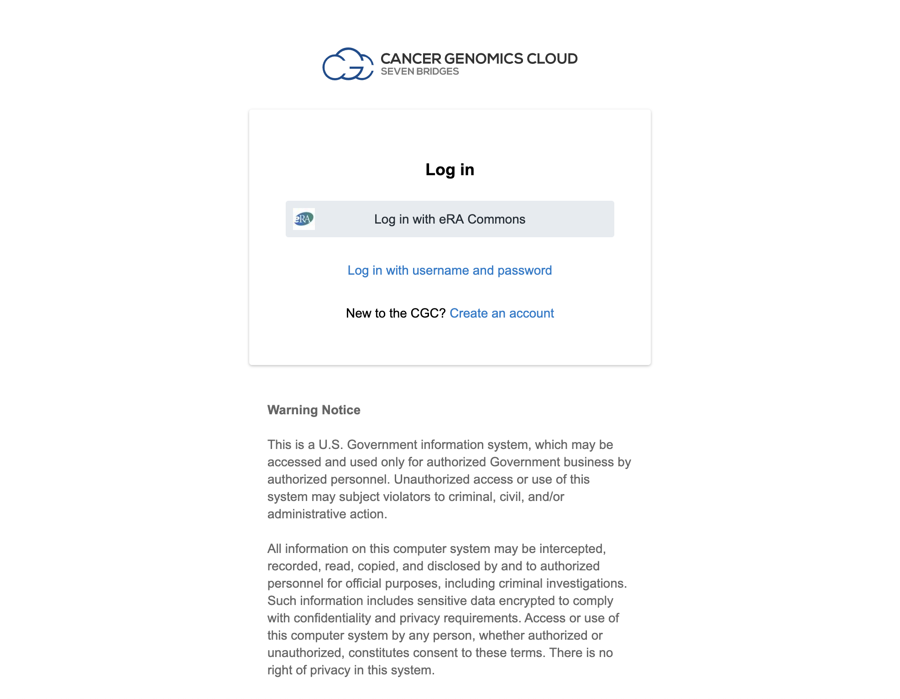

Access Connections
==================

Ultimately, our goal is to analyze existing Kids First data in new ways,
or in new combinations, in order to improve medical outcomes. However,
before we can start using the data, we need to do a lot of set up.

There's even more setup???
---------------------------

Recall that we want to use Cavatica to analyze human data we find using
the portal. So far, we've created Cavatica and Portal accounts, and
connected those them to each other. However, we haven't yet told either
Cavatica or the Portal what data we are authorized to see and use.

Typically, the groups who store and distribute human data are different
from the groups who are dedicated to processing and approving
applications for human data use, monitoring those applications. So, the
Kids First DRC stores and distributes the Kids First metadata, but they
don't decide who has access. Similarly, Cavatica doesn't decide who
can use the Kids First data files, even though they regulate that
access. We need to tell both interfaces what credentials we have for
data access.

### Data Repository Integrations in the Portal

To tell the Portal what data it should show us, we need to set up Data
Repository Integrations.

These require an eRA Commons ID. If you don't have an eRA Commons ID,
you can still browse the public data on Kids First, however you won't
be able to access any controlled access data that you may have been
granted access to. If you don't yet have an eRA Commons ID, skip to
Cancer Genomics Cloud access in Cavatica.

#### Step 1

Click on each of the `Connect` buttons in turn, and use your
eRA login credentials to set up the connection. Note that for the NCI
CRDC integration, you must authorize Gen3.

!!! Tip

    Researchers get eRA Commons IDs through their home institution, [you can
    learn more about getting an ID
    here](https://era.nih.gov/register-accounts/understanding-era-commons-accounts.htm)

### Cancer Genomics Cloud access in Cavatica

To tell Cavatica what data we should have access to, we need to connect
to the [Cancer Genomics Cloud](http://www.cancergenomicscloud.org/).

#### Step 1 Get logged in to Cancer Genomics Cloud

Navigate to [Cancer Genomics Cloud](http://www.cancergenomicscloud.org/)
and either log in using your eRA Commons ID (preferred) or log in by
creating a new account using the `New to the CGC? Create an
account` link. Whichever way you log in, be sure to agree to
authorize Gen3.

!!! Note

    This website should look and feel very familiar, as it hosted by Seven
    Bridges: the same company that build Cavatica. The difference is that
    the Cancer Genomics Cloud makes decisions about data access, whereas
    Kids First and Cavatica don't. Still, we are, in effect, connecting one
    account we made on Seven Bridges to another account we made on Seven
    Bridges.

#### Step 2 Go to the Cancer Genomics Cloud Developer Dashboard

Remember a few steps ago when we talked about "Authentication Tokens"
and how they are a common way to connect accounts? They're so common,
we're using another one here!

Click on the Developer tab at the top of the screen, and select
Authentication Token:

#### Step 3 Click on the Auth token link

You should get a page that looks something like this:

#### Step 4 Generate and copy your Authentication Token

As we did when getting our Cavatica Auth Token, click on the
`Regenerate` button to create a new Authentication Token,
and then click the copy button (indicated with a purple arrow below) to
copy it to your clipboard:

!!! Tip

    Keep this tab

    We still have some clicking around to do before we use this token, so
    it's best to leave this tab open until we're done, so you can re-copy
    it if you need to

#### Step 5 Get logged in to Cavatica

If you aren't still logged in to Cavatica, open
<https://cavatica.sbgenomics.com/> in a new tab or window and use the
credentials you set up earlier in this lesson to log in.

Once you're logged in, you should see this screen:

#### Step 6 Navigate to Settings

Click on your name (top right) and Account Settings:

#### Step 7 Navigate to Dataset Access

Cavatica calls a connection to other resources "Dataset Access". It is
generic, because in theory, you could connect Cavatica to any place that
authorizes dataset use, however currently the only option available is
the Cancer Genomics Cloud.

Click on "Dataset Access", indicated with the purple arrow below:

#### Step 8 Input your Authentication Token

We've already created a Cancer Genomics Cloud account, and generated
our token, so we can ignore the learn more and paste our token and click
\`connect account\`:

!!! Tip

    Token Security

    An Authentication Token is kind of like a password, you don't want to
    share it, or post it anywhere public. Anyone who pastes your
    Authentication Token into their Cavatica account will have access to the
    datasets you are authorized to use by the Cancer Genomics Cloud. If you
    want to give your trainees or collaborators access to your datasets, you
    must have them added to your CGC data approval, so that their data
    access is updated in their own CGC account.

#### Step 9 Checking statuses

If everything is set up correctly, you should, at a minimum, see that
your `Open Datasets` have become green and 'unlocked'
(indicated with a purple arrow below). If you have been granted access
to any protected data, you may see more green and unlocked datasets than
are shown here:

