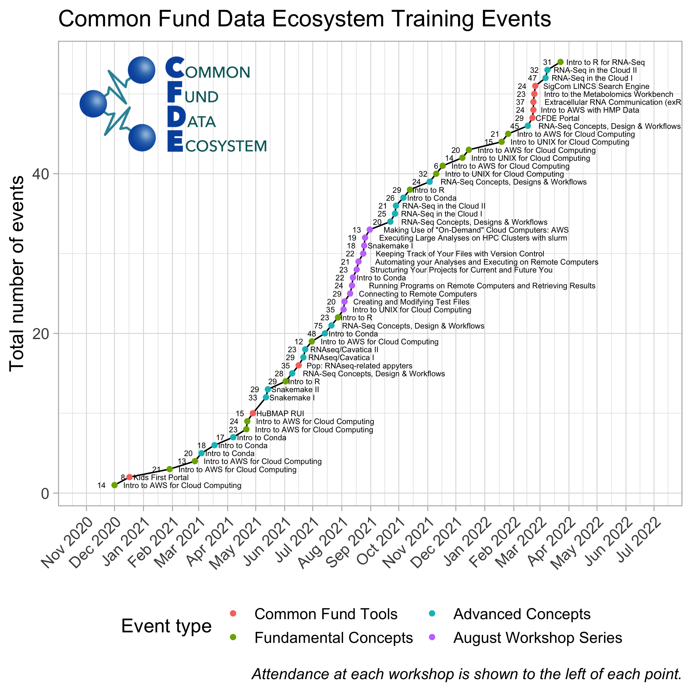

# Workshop History

Below is a list past CFDE workshops with links to workshop resources.

## 2022

* [Introduction to R for RNA Sequencing Analysis](https://hackmd.io/MsWY1O9GQXGVDl2OmV2jxg) ([video recording](https://video.ucdavis.edu/media/CFDE+May+Hackathon+-+Intro+to+R+for+RNA-Seq/1_61sjku7o)) _May 11, 2022_ 
* [CFDE Portal Demo with Human Microbiome Project Data, AWS, and sourmash](https://hackmd.io/dW9EoOh3T42eed9q21NLJQ?view#) ([video recording](https://video.ucdavis.edu/media/t/1_yze086oo) _May 10, 2022_
* [Introduction to R for RNA Sequencing Analysis](https://hackmd.io/SnorsWTbTTyRenptpjrhww?view) _April 27, 2022_ 
* [Introduction to R for RNA Sequencing Analysis](https://hackmd.io/@raynamharris/r4rnaseq-workshop) _March 23, 2022_  
* [RNA-Seq in the Cloud](https://osf.io/txcw8/) _March 7 and 9, 2022_  
* [Introduction SigCom LINCS Search Engine](https://nih-cfde.github.io/2022-feb-hackathon/about/) _February 24, 2022_ 
* [Extracellular RNA Communication (exRNA)](https://nih-cfde.github.io/2022-feb-hackathon/about/) _February 23, 2022_ 
* [Introduction to to the Metabolomics Workbench](https://nih-cfde.github.io/2022-feb-hackathon/about/) _February 22, 2022_ 
* [Introduction to AWS with Human Microbiome Project (HMP) Data](https://hackmd.io/9EWhx5vYR3SDmd1Nl9rpyQ?view) ([video recording](https://video.ucdavis.edu/media/Hackathon+-+Day+2+-+HMP/1_evaoqlpg))  _February 22, 2022_ 
* [CFDE Portal Demo](https://app.nih-cfde.org/) ([video recording](https://video.ucdavis.edu/media/Hackathon+-+Day+1+-+Portal+Demo/1_cr0ert97)) _February 21, 2022_ 
* [RNA-Seq Concepts, Design and Workflows](https://osf.io/kj5av/) _February 15, 2022_
* [Introduction to AWS for Cloud Computing](https://github.com/nih-cfde/training-and-engagement/wiki/A-Hands-on-Introduction-to-AWS-for-Cloud-Computing-January-26,-2022) _January 26, 2022_ 
* [Introduction to UNIX for Cloud Computing](https://github.com/nih-cfde/training-and-engagement/wiki/An-Introduction-to-UNIX-for-Remote-Computing:-January-19,-2022) _January 19, 2022_    

## 2021

* [An Introduction to AWS for Cloud Computing](https://github.com/nih-cfde/training-and-engagement/wiki/A-Hands-On-Introduction-to-AWS:-December-15,-2021)  _December 15, 2021_
* [An Introduction to UNIX for Cloud Computing](https://github.com/nih-cfde/training-and-engagement/wiki/An-Introduction-to-UNIX-for-Cloud-Computing---December-8,-2021)  _December 8, 2021_
* [Introduction to the UNIX Command Line](https://github.com/nih-cfde/training-and-engagement/wiki/An-Introduction-to-UNIX:-November-17,-2021) _November 17, 2021_  
* [Introduction to AWS for Cloud Computing](https://github.com/nih-cfde/training-and-engagement/wiki/A-Hands-On-Introduction-to-AWS:-November-10,-2021) _November 10, 2021_  
* [Introduction to R](https://github.com/nih-cfde/training-and-engagement/wiki/Introduction-to-R:-October-13,-2021) _October 13, 2021_  
* [Introduction to Conda](https://github.com/nih-cfde/training-and-engagement/wiki/A-Hands-On-Introduction-to-Conda:-October-6,-2021) _October 6, 2021_  
* [RNA-Seq in the Cloud](https://github.com/nih-cfde/training-and-engagement/wiki/RNA-Seq-in-the-cloud:-June-21-&-23,-2021) _September 21 & 23, 2021_ 
* [RNA-Seq Concepts, Design and Workflows](https://osf.io/txcw8/) _September 22, 2021_  
* [Introduction to AWS for Cloud Computing](https://ngs-docs.github.io/2021-august-remote-computing/making-use-of-on-demand-cloud-computers-from-amazon-web-services.html) _August 31, 2021_  
* [Using SLURM on HPC](https://ngs-docs.github.io/2021-august-remote-computing/executing-large-analyses-on-hpc-clusters-with-slurm.html) _August 26, 2021_  
* [Automating using Snakemake](https://ngs-docs.github.io/2021-august-remote-computing/automating-your-analyses-with-the-snakemake-workflow-system.html) _August 25, 2021_ 
* [Using Version Control](https://ngs-docs.github.io/2021-august-remote-computing/keeping-track-of-your-files-with-version-control.html) _August 24, 2021_
* [Automating Analyses](https://ngs-docs.github.io/2021-august-remote-computing/automating-your-analyses-and-executing-long-running-analyses-on-remote-computers.html) _August 19, 2021_  
* [Structuring Project Folders](https://ngs-docs.github.io/2021-august-remote-computing/structuring-your-projects-for-current-and-future-you.html) _August 17, 2021_  
* [Installing Software with Conda](https://ngs-docs.github.io/2021-august-remote-computing/installing-software-on-remote-computers-with-conda.html) _August 13, 2021_
* [Running Programs and Retrieving Results](https://ngs-docs.github.io/2021-august-remote-computing/running-programs-on-remote-computers-and-retrieving-the-results.html) _August 12, 2021_  
* [Connecting Remote Computers with SSH](https://ngs-docs.github.io/2021-august-remote-computing/connecting-to-remote-computers-with-ssh.html) _August 10, 2021_ 
* [Creating & Modifying Text Files](https://ngs-docs.github.io/2021-august-remote-computing/creating-and-modifying-text-files-on-remote-computers.html) _August 4, 2021_ 
* [Introduction to UNIX Command Line](https://ngs-docs.github.io/2021-august-remote-computing/introduction-to-the-unix-command-line.html) _August 3, 2021_  
* [Introduction to R](https://github.com/nih-cfde/training-and-engagement/wiki/Introduction-to-R:-July-28,-2021) _July 28, 2021_  
* [RNA-Seq Concepts, Design and Workflows](https://osf.io/txcw8/) _July 21, 2021_  
* [A Hands-On Introduction to Conda](https://github.com/nih-cfde/training-and-engagement/wiki/A-Hands-On-Introduction-to-Conda:-July-14,-2021) _July 14, 2021_ 
* [Introduction to Amazon Web Services for Cloud Computing](https://github.com/nih-cfde/training-and-engagement/wiki/A-Hands-On-Introduction-to-AWS:-June-30,-2021) _June 30, 2021_  
* [RNA-Seq in the Cloud](https://github.com/nih-cfde/training-and-engagement/wiki/RNA-Seq-in-the-cloud:-June-21-&-23,-2021) _July 14, 2021_ 
* [Introduction to RNA-Seq Analysis with Appyters](https://us06web.zoom.us/rec/share/wYs0AGJ8cQHZ_UhaE1JJ4q4JmM8K7-F_S95t1OxLPwyuezTTlGjVtGz4ruqwGMp*0ZBYwGZFeeVAoncw?startTime=1623862864000) _June 16, 2021_
* [RNA-Seq Concepts, Design, and Workflows](https://osf.io/kj5av/) _June 9, 2021_  
* [Introduction to R](https://github.com/nih-cfde/training-and-engagement/wiki/Introduction-to-R:-June-2,-2021) _June 2, 2021_  
* [CFDE Portal Demo](https://training.nih-cfde.org/en/latest/Common-Fund-Tools/CFDE-Portal/) _May 26, 2021_  
* [Introduction to Workflows: Snakemake](https://github.com/nih-cfde/training-and-engagement/wiki/Introduction-to-Workflows:-Snakemake-Part-I-&-II-May-12-&-14th,-2021) _May 12 & 14, 2021_  
* [Introduction to Amazon Web Services for Cloud Computing](https://github.com/nih-cfde/training-and-engagement/wiki/A-Hands-On-Introduction-to-AWS:-May-05,-2021) _May 5, 2021_ 
* [Introduction to 3D Tissue Mapping](https://github.com/nih-cfde/training-and-engagement/wiki/Introduction-to-3D-Tissue-Mapping:-April-28,-2021) _April 28, 2021_  
* [Introduction to Amazon Web Services for Cloud Computing](https://github.com/nih-cfde/training-and-engagement/wiki/A-Hands-On-Introduction-to-AWS:-April-22,-2021) _April 22, 2021_  
* [Introduction to Amazon Web Services for Cloud Computing](https://github.com/nih-cfde/training-and-engagement/wiki/A-Hands-On-Introduction-to-AWS:-April-21,-2021) _April 21, 2021_
* [CFDE Portal Demo](http://bit.ly/3abyDy0) _April 14, 2021_
* [Introduction to Conda](https://github.com/nih-cfde/training-and-engagement/wiki/A-Hands-On-Introduction-to-Conda:-April-7,-2021) _April 7, 2021_ 
* [Introduction to Conda](https://github.com/nih-cfde/training-and-engagement/wiki/A-Hands-On-Introduction-to-Conda:-March-18,-2021) _March 18, 2021_  
* [Introduction to Conda](https://github.com/nih-cfde/training-and-engagement/wiki/A-Hands-On-Introduction-to-Conda:-March-4,-2021) _March 4, 2021_  
* [Introduction to AWS for Cloud Computing](https://github.com/nih-cfde/training-and-engagement/wiki/A-Hands-On-Introduction-to-AWS:-February-25,-2021) _Feb 25, 2021_ 
* [Introduction to AWS for Cloud Computing](https://github.com/nih-cfde/training-and-engagement/wiki/A-Hands-On-Introduction-to-AWS:-January-29,-2021)  _Jan 29, 2021_ 

## 2020

* [Introduction to the Kids First Data Resource Portal](https://training.nih-cfde.org/en/latest/Common-Fund-Tools/Kids-First/) _Dec 17, 2020_
* [Introduction to AWS for Cloud Computing](https://github.com/nih-cfde/training-and-engagement/wiki/A-Hands-On-Introduction-to-AWS:-December-1,-2020) _Dec 1, 2020_  

## Graphical Summary

