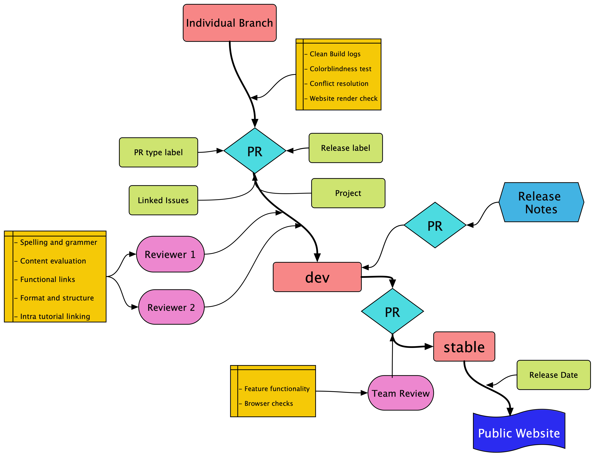

# CFDE Training Website Release Plan

This is the release plan for the [CFDE training website](https://cfde-training-and-engagement.readthedocs-hosted.com/en/latest/).
This plan has sections to address the different release management topics:

- [ ] Definition of release numbering and naming convention
- [ ] Definition of expected release frequency
- [ ] Locations for release documentation, repo etc
- [ ] Roles and responsibilities for the releases
- [ ] Definition of steps in a release cycle

## Release Dates

Timeline for release 2020-2021

| Release # | Date | Month     | Year | Version tag |
| --------- | ---- | --------- | ---- | ----------- |
| 1         | 15   | August    | 2020 | 2020.08     |
| 2         | 15   | October   | 2020 | 2020.10     |
| 3         | 15   | December  | 2020 | 2020.12     |
| 4         | 15   | March     | 2021 | 2021.03     |
| 5         | 15   | June      | 2021 | 2021.06     |
| 6         | 15   | September | 2021 | 2021.09     |
| 7         | 15   | December  | 2021 | 2021.12     |

Our current release dates are set to coincide with NIH deliverable dates.

#### Labels format
Name: release.month(short form)-release.year
For example, *Oct-2020*.

## Release Checklist

A series of checklists will be implemented to ensure error free working tutorials are released to the public.

Individual tutorials will follow the formatting, organization, and layout details described in the [training website style guide](https://hackmd.io/Znxo_eOBQsaxszl_Uduk5A?view#Contributing-to-the-nih-cfde-Training-and-Engagement-website).

Individual branches create a PR for merge into `dev`.
The PR author should ensure:
- [ ] Descriptive title - Title should convey PR changes and will reflect in release notes
- [ ] Clean build logs - Automated check for correct documentation build
- [ ] Colorblindness test https://www.toptal.com/designers/colorfilter/
- [ ] Correct rendering of website (preview of their branch using autogenerated RTD link)
- [ ] Resolution of any merge conflicts
- [ ] Release label - Tagging the upcoming release, e.g. `Oct-2020`
- [ ] PR type label - `new` for new content, `feature` or `enhancement` for new features, `fixes` for updates and fixes to existing content
- [ ] Assignment to the appropriate project - Project board for a given release for tracking
- [ ] Linking of related issues - If applicable

Note that for a PR to be included in the release notes, it needs to be associated with **both** the release label and the PR type label. It is also possible to add labels and edit titles after the merge but prior to the internal release deadline.

Following the PR to merge into `dev`, the reviewers must ensure the tutorials pass the checklist for:
- [ ] spelling and grammar
- [ ] successful run of all installation and code chunks
- [ ] sufficient explanation and details for the tutorial content - Suggestions for inclusion of admonition boxes or additional resources for clarity
- [ ] code syntax and naming convention - multi code lines have explanation, choice of variable names and connecting different steps if applicable
- [ ] adherence of tutorial format to style guide
- [ ] functional links (inter and intra) - check the automated broken links check for clean build, suggest intra links if applicable
- [ ] accessible hyperlink text - meaningful text hyperlinked instead of default click here

### Review process

The overall workflow is visualized in the flow diagram of the review process.

The review process is split between the two levels of merge. Individual branches get merged into `dev` and all the changes for a release are collectively merged from `dev` into `stable` which is the base for the public facing website.

Merge into `dev` from individual branch requires two reviews while merge into `stable` requires group approval. Currently,
automated reviewer assignment has been implemented which assigns the correct number of reviewers depending on the merging branch. However, in scenario where the team member with experience in a tutorial topic is not assigned to review the tutorials, one can manually add an additional reviewer. Alternatively, that team member can offer their review in form of comments on the PR. It will be the responsibility of the PR author to communicate with the additional reviewers apart from the auto assigned reviewers are notified of the PR and that they follow up for their review.

## Release Cycle

Each Release cycle will be defined as the time period between the releases. The release cycle will have some set phases:
- tracking
- planning
- development
- internal release deadline
- final merge
- public release

### Tracking

Using 'Projects' in GitHub we will create and track issues throughout the release cycle.

### Planning

Each release cycle there are different tasks to be completed:
- New tutorial development
- Fixes to existing tutorials
- GitHub management - creating issues and labels - tracking
- New tutorial reviews
- General reviews
- Reviews for merge into `stable`
- Release note maintenance

The planning phase scheduled following a release will allow for discussion and assignment of the different roles for the upcoming release. This phase will also include discussion for generating new content and creation of appropriate issues in the training repo.

### Development

This phase will include work on developing new content and enhancing published tutorials.

- It is recommended that the authors developing new tutorials provide at least 1 week for the review process when the tutorial is ready.
- When possible include installation and setup steps across all target platforms (Mac, linux, Windows)
    - Provide links to setup instructions if it already exists as standalone tutorials
    - For overlapping setup instructions that are part of an existing tutorial, check if the setup instructions can be reorganized
      into standalone modules if not already in that format.
- To ensure tracking and linking of related issues, the authors involved in tutorial creation or fixes should create related issues in the training-and-engagement GitHub repo and assign appropriate labels for the release.

### Internal release deadline

Internal Release Deadline: five business/working days prior to release date

This phase will involve finalizing release-notes for the website. A draft of the release notes will be auto generated based on PR merges into `dev`.  
To access the draft
- access the `Releases` tab on the main repo page
- click on `Create a new release`
- subsequently click on `Releases`
- Use the `Edit` button on the right top corner
- Modify the release titles if applicable, add date and save draft

Checklist for internal release:
   - All PRs tagged for the upcoming release start preparation for successful merge into `dev` and successfully rendered.
   - The original PR author should ensure all review comments (if any) are addressed prior to merge.
   - All new tutorials should follow the style guide for formatting and tutorial arrangement.
   - If changes requested from a reviewer on a PR cannot be completed by the internal release deadline, the PR author
     should relabel with the next release date.
   - Connect intra tutorials that were merged into `dev` if applicable
   - Release notes are modified and merged.

### Final merge

This phase will involve merging `dev` into `stable`. Allotted timeline would be 5 business/working days until release date. Merging from `dev` to `stable` requires group approval. For this phase, one PR will be opened for merge into `stable` and the approval for merge will be based on the rendered website with the following checklist:
   - If new features were merged check for functionality across entire site
   - Check for tutorial rendering on multiple browsers, modes (normal, incognito) and devices (phone, tablet, laptop)
        - [ ] Chrome
        - [ ] Safari
        - [ ] Edge
        - [ ] Firefox

### Public release

After the creation of release notes and the successful merge of `dev` into `stable` we will announce the release on GitHub, Twitter, the website, and through the CFDE Newsletter.

Jose and Jeremy handle the newsletter while Titus and Amanda handle the twitter page for CFDE. All of them should be tagged and/or pinged after the release for appropriate announcements.  

## Release Documentation

The Github repo for the training website will host a release section and associated tag information.

For documentation version numbering system we will follow the release date convention. Thus our release tag would have the format: **`YYYY.MM`**

For example October 2020 release would have the tag **`2020.10`**. This would follow the same convention as set for labels on GitHub repo.

For the public release on GitHub repo, set the default branch to `stable` and add release tag.

The release information will also be documented in a markdown file `index.md`, hosted within `Releases` folder under the `/docs` folder structure of the training repo in Github. Editing of the the website release version will include removing `Website Features` category, intra linking of tutorials mentioned and documenting changes to existing tutorials under the `Updates and Fixes` category. Addition of enhancements features like vidlets, images, screencasts etc to existing tutorials can be highlighted in a separate category (Enhancements or Improvements) if applicable.

The release notes will also be referenced in the landing page of the training website.

Release Format:

 > Latest Release
 >
 > Updated Release.Month Release.Date, Release.Year
 >
 > New Tutorials
 > Links to new tutorials added in the current release
 >
 > Improvements or Enhancements (optional)
 >
 > Any enhancements to tutorials or website features. This would include any additional screencasts, vidlets,
 images that were added to tutorials and integrated website features
 >
 > Updates and Fixes
 >
 > This section will highlight any code or link fixes to existing tutorials in addition to any clarification notes and explanation that was added.
