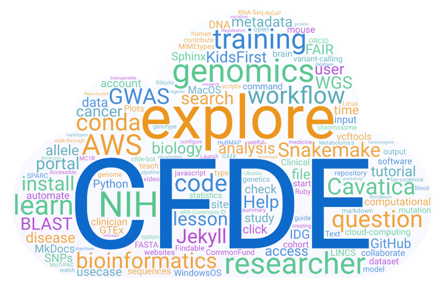

# Welcome to the CFDE Training Resource Center!

Our mission as the **Common Fund Data Ecosystem (CFDE)** Coordination Center is to make **Common Fund (CF)** data accessible to researchers like you. Choose from our growing list of tutorials and resources to learn how to perform bioinformatic analyses and access data. 

To get started, visit the [Bioinformatics Skills](./Bioinformatics-Skills/index.md) section for tutorials on setting up a computing environment and conducting common bioinformatic analyses. 

Learn how to build cohorts and export metadata at the [Kids First Portal](./Bioinformatics-Skills/Kids-First/index.md) and across multiple CF datasets using the [CFDE Portal](./Bioinformatics-Skills/CFDE-Portal/index.md).

Check the [release notes](./Release-Notes/index.md) for our latest tutorial updates. If you have comments or suggestions, please [contact us](mailto:coordination@CFDE.groups.io)!
