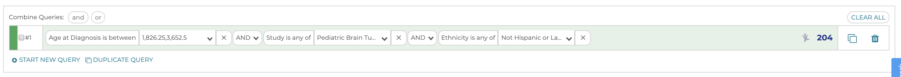
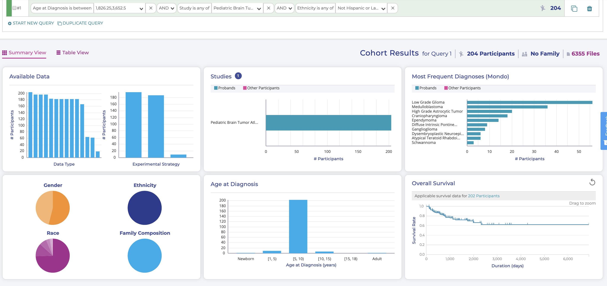
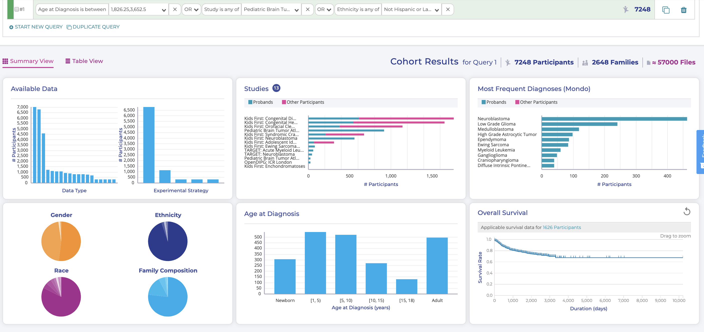

================================
Advanced Querying- ANDs and ORs
================================

   **Multiple Filters**

Note that all of your filters are automatically connected by "AND"s, but that
might not always be what you want. If I wanted to see the participants that meet
at least one of my filters, but not all of them, I can click on an "AND" and change
it to "OR", which dramatically changes my results:

|pic1| AND vs OR |pic2|

Note that when you change one AND/OR selection, it changes *all* of the AND/OR
boxes in that query line.
