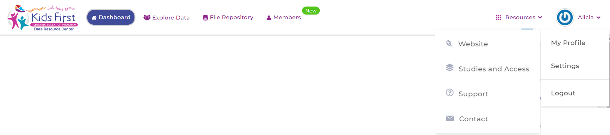

Account Connections
====================

There's more setup???
======================================

Recall that our goal is to use Cavatica to analyze data we find
using the portal, which means our two accounts need some kind of connection.
However, when we made our account for Cavatica, we went to a separate website,
and logged in using a completely different identity than we did at the Kids First
DRC Portal. At Cavatica, we used our eRA Commons ID (or an email), but at the Portal
we used an ORCID. So, we will have to tell our two accounts about each other.

But that's not all. Since the data we want to use is from Kids First, it is subject to human
data protections. Right now, we haven't told the portal or Cavatica about our
credentials, or what we're authorized to see. Remember that there are rules about
human data *even if it's open data* so we will need to tell these systems a bit
about ourselves before they trust us.

*********************************************
Authorizing your Kids First DRC Portal Account
*********************************************

Step 1
******

     **KFDRC Portal Dashboard.**

   All set? Great! Now that we have accounts, let's start familiarizing ourselves with KFDP and Cavatica. We're going to start with KFDP.

   ### Kids First Data Portal Orientation
   #### Portal Home Page
   1. #### Site Overview

   Let's take a look at the KFDP Homepage. At the top we see this bar:

   Does your page look like this? F5 (Windows) or Cmd+Shift+R (MacOS) to refresh, or the refresh button.

   

   Where do we start? Remember: the data we want lives on KFDP but our tools live in Cavatica. So the first thing we're going to do is make KFDP and Cavatica talk to each other. This is what KFDP calls "Application Integration."

   * Click on your name (top right) --> Select Settings --> Scrool down to Application Integration --> Click "Connect"

   Need authentication token for API endpoint from Cavatica
   Go back to Cavatica --> Developer --> Authentication token --> Generate --> copy and paste this code into KFDP

   All set? Not quite. Even though KFDP and Cavatica are now linked, we need to give *permission* for the KFDP data to get pushed over to Cavatica, our cloud computing resource. This is what KFDP calls "Data Repository Integration."

   Need eRa commons, NIH login.
   ***This is a holdup for trainees.
   ***Can we skip this part? It's for controlled access data.

   * From the same page as the Application Integration, scroll up slightly and choose "Connect" for both the KF Framework Services and NCI CRDC.
   * You will need your NIH logon credentials.
