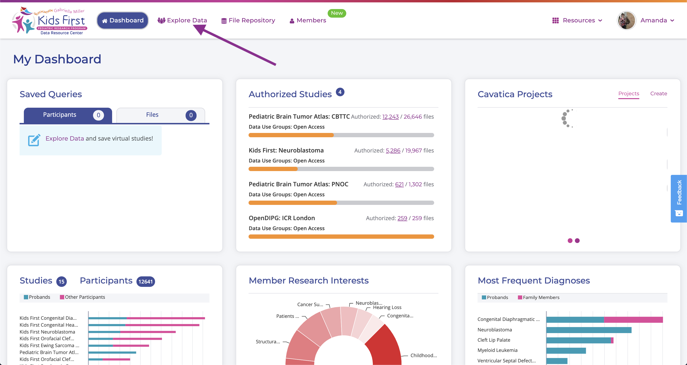
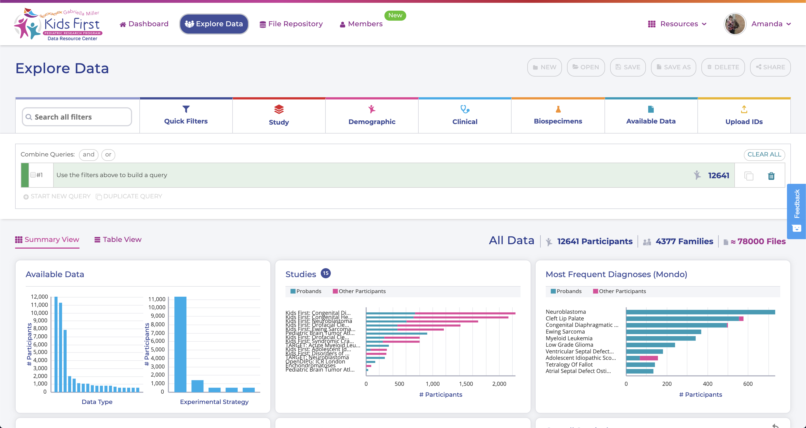
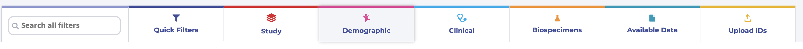
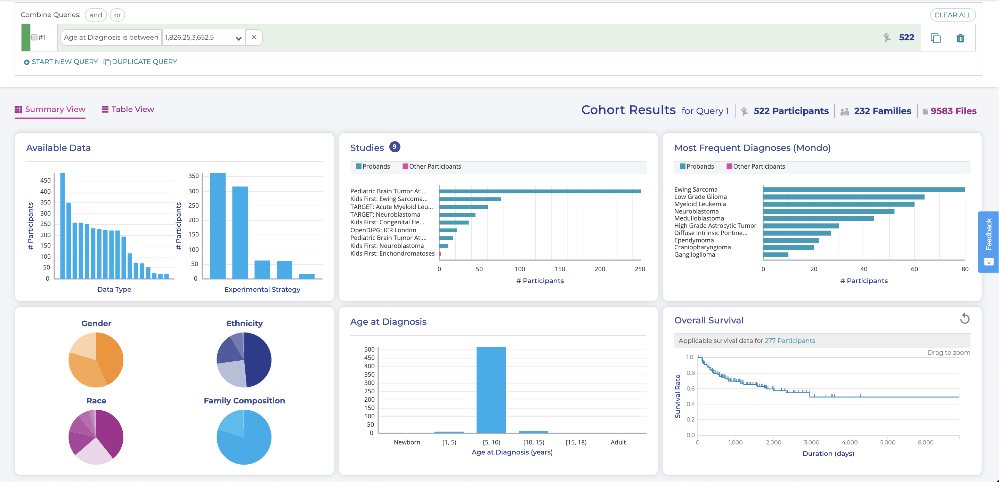
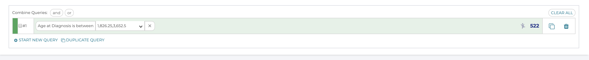
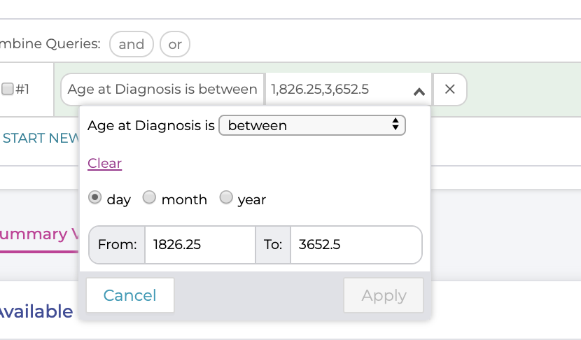
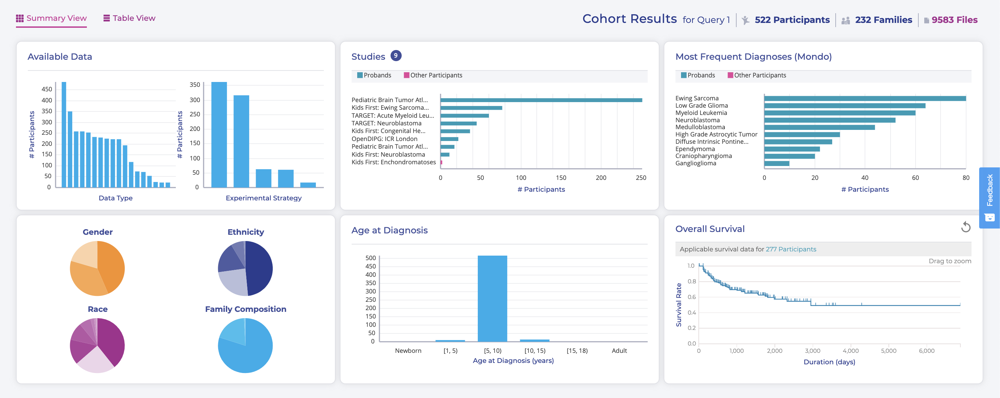
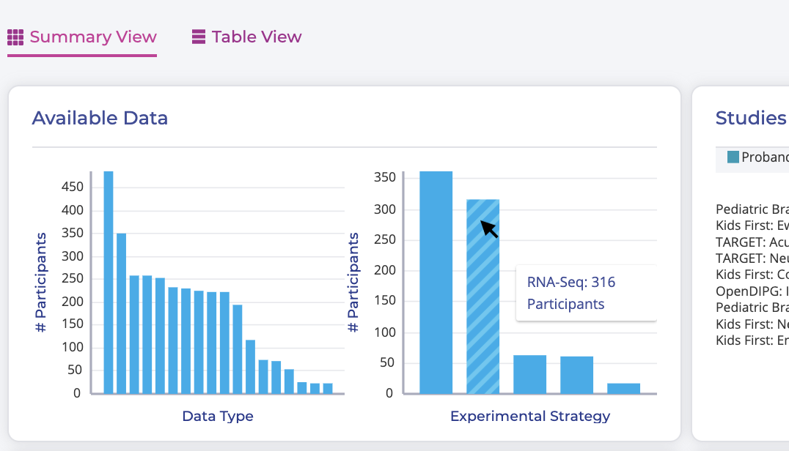

=============================
Exploring Data in the Portal
=============================

Now that all of our accounts are interconnected, let's actually explore the data.

What data is here?
=============================

The data at the Kids First DRC is from children with
childhood cancer and structural birth defects or their family members.
As of early 2020, the Kids First DRC maintains Whole Genome Sequences (WGS)
and/or RNAseq data for over 12,000 individuals. However, Kids First doesn't only
host data about DNA and RNA. Using the portal you can access a wide range of
data types including Histology Images, Pathology Reports, Radiology Images,
Radiology Reports, Operation Reports, Annotated Somatic Mutations, Gene Fusions,
Gene Expression, Somatic Copy Number Variations, and Isoform Expression.

Step 1 Get logged in to the Kids First DRC Portal
**************************************************

If you aren't still logged in to the Kids First Portal, navigate to
`https://portal.kidsfirstdrc.org/ <https://portal.kidsfirstdrc.org/>`_ and use the
credentials you set up previously in this lesson to log in. When you first log in,
you will see this screen:

.. figure:: ./images/KidsFirstPortal_11.png
   :align: center
   :figwidth: 60 %

   **Kids First Dashboard.**

Step 2 Navigate to the Explore Data tab
**************************************************

Click on `Explore Data`

   **Go To Explore Data**

You should now be on a page that looks like this:

   **Explore Data**

Exploring the Data
=============================

It is important to get a sense of what data exists before we start filtering
down and designing an experiment. This page gives us a set of six interactive plots
that display the overall data. You can impose filters on the data in two different
ways:

* By using the filter buttons
* By clicking a graph component of any plot

Filter buttons
**********************************

   **Explore Data Filters**

To use the filter buttons, click on one, choose from the options in that button,
and click `apply`.

.. admonition:: Exercise:
    :class: exercise

    Use the `Clinical` button to filter the data to include only samples where
    the patient was between 5 and 10 years old when they were diagnosed.

.. hidden-code-block:: python
    :starthidden: True
    :label: --- SHOW ANSWER ---

    Click |H| `Clinical` then `Age at Diagnosis`. Choose `between` in the first
    dropdown, check `year` in the middle, and then type the numbers 5 in the `from`
    box and 10 in the `to` box. Click `Apply`.

If you applied this filter successfully, you should see something like the following:

   **Age at Diagnosis between 5 and 10 years old**

Several things about the page have now changed. First, there is now information
in our queries box

   **Queries Box**

It now says what query we are currently looking at, and how many participants are
in our query. Note that it says we chose ages between 1826.25 and 3652.5, which
means it automatically calculated 5-10 years in days. If we wanted to change that
number, we could do so in this bar by clicking the small arrow next to the age range.
A pop up with the same selection box we saw before will appear, and let us change
our selections:

   **Editing Queries**

Cohort Results plots
**********************************

The other big change on this page is that all of the plots have dynamically
updated, and this section has been renamed from "All data" to "Cohort Results
for Query":

   **Cohort Results Plots**

The most notable difference here, is that the distribution in the "Age at Diagnosis"
plot in the center bottom has narrowed dramatically, which is expected given our
query. All of the plots shown in this section respond dynamically to the query
buttons, but they also can be used to build and refine queries, or to see extra
information. For instance, if you hover your mouse pointer over a bar in the
'Experimental Strategy' plot of the "Available Data" section, you'll get the count
of that bar and its x-axis label:

   **Extra Plot Information**

You can continue to filter and refine your cohort by clicking on the bar in a
chart or slices in a pie chart. Note that each time you make a selection in a plot,
that filter is added to your query box above.

.. admonition:: Note:
   :class: tip

   When we ran this query in early 2020, Kids First had data on 522 Participants who
   were diagnosed between the ages of 5 and 10. If you are doing this tutorial later,
   you may see more or different data.

.. admonition:: Exercise:
    :class: exercise

    Choose some different options from the **Quick Filters** and/or plots to build
    a query with multiple filters

***************************************************
Advanced Querying
***************************************************

ANDs and ORs
**********************************

Once you've build a multiple filter query, your query box should look something
like this:

.. figure:: ./images/KidsFirstPortal_20.png
   :align: center

   **Multiple Filters**

Note that all of your filters are automatically connected by "AND"s, but that
might not always be what you want. If I wanted to see the participants that meet
at least one of my filters, but not all of them, I can click on an "AND" and change
it to "OR", which dramatically changes my Results

|pic21| AND vs OR |pic22|

.. |pic21| image:: ./images/KidsFirstPortal_21.png
   :width: 45%

.. |pic22| image:: ./images/KidsFirstPortal_22.png
   :width: 45%

.. admonition:: Challenge:
   :class: exercise

    * The most expedient way to do this is to click the **Quick Filters** button. Let's try that now.
    * Choose some different options from the **Quick Filters** category and watch how your **Cohort Results** change.
    * To further refine your **Cohort Results** select more categories along the navigation bar.
    * Clicking on the graphics also adds filters to the data
    * Need to cover how to remove the filter
