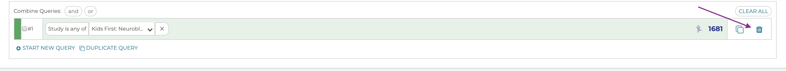

=============================
Clearing and Changing Queries
=============================

There are several ways to change your query.

Change the parameters of a filter
**********************************

If still want to filter by age range, but to use different ages,
we could do so in query bar by clicking the small arrow next to the age range.
A pop up with the same selection box we saw before will appear, and let us change
our selections:

.. figure:: ./images/KidsFirstPortal_17.png
   :align: center
   :figwidth: 50 %

   **Editing Queries**

Removing a filter
**********************************

To remove a single filter from your query by clicking the `x` to the right
of the filter description:

.. figure:: ./images/KidsFirstPortal_24.png
   :align: center
   :figwidth: 80 %

   **Removing Filters**

Removing an Entire Query
**********************************

To remove the entire query and start over by clicking the trash can icon at the
far right of the query line:

   **Removing Queries**

.. admonition:: Exercise:
    :class: exercise

    If you haven't already, remove your current query. Using the **Quick Filters**
    and/or plots build a query to only include data from the Pediatric Brain
    Tumor Atlas, and non-Hispanic or Latino
    patients who are between 0 and 5 years old

Once you've built a multiple filter query, your query box should look something
like this:

.. figure:: ./images/KidsFirstPortal_20.png
   :align: center
   
   **Multiple Filters**
