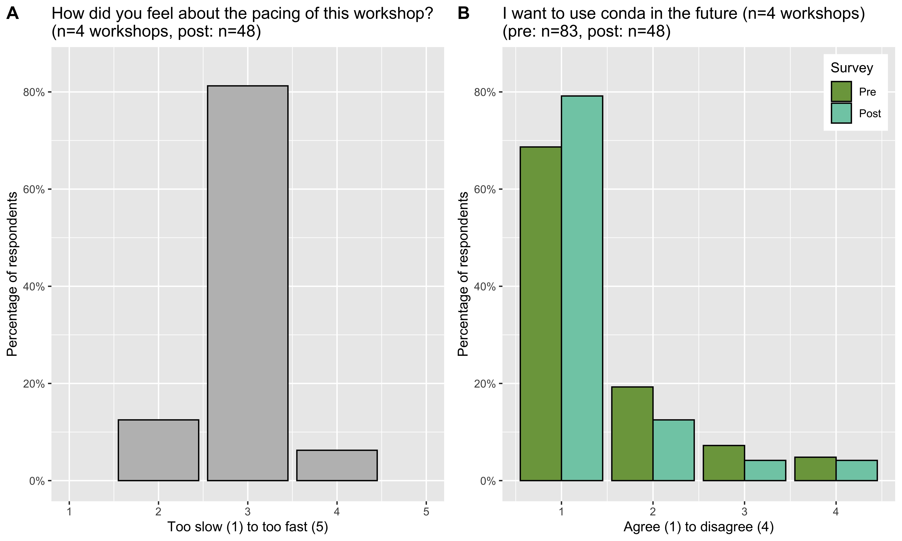

# Summary

We present our lesson material and resources for teaching how to use conda (https://conda.io), a tool that streamlines software installation and version management using isolated environments, while providing multiple methods for reproducing and sharing software set ups. This training material was developed for the NIH Common Fund Data Ecosystem (CFDE), whose primary goal is to teach biologists computational tools that help make their analysis workflows FAIR: Findable, Accessible, Interoperable, and Reusable [@Wilkinson_etal_2016]. 

We teach conda because it can be used in any research field that requires software installation, works on multiple computer operating systems (Mac, Windows, Linux), and does not require administrator privileges to configure. We piloted this material in March 2021 and have now taught the 2-hour online workshop five times to a diverse audience. The lesson material and accompanying resources provide information for instructors to adopt our hands-on workshop format and for learners to view past workshop notes or walk-through the lesson at their own pace from our [training website](https://training.nih-cfde.org/en/latest/General-Tools/Introduction-to-Conda/).

# Statement of Need

As a consequence of switching to fully remote-compatible training due to the COVID-19 pandemic, we designed online material for self-paced and virtual workshop learning modes. Existing conda tutorials typically teach learners how to run commands with the assumption that learners' computer configuration and software versions match those in the lesson, however software and system set-up can be time-consuming, and distract or dissuade learners from wanting to use conda.

For our lesson, we specifically designed our materials to run on a binder cloud computing environment that is free and easy to launch [@binder]. This structure allows learners to focus on the course content because the computing environment provides standardized interface and software versions; works for Mac, Windows, and Linux users; and reduces remote troubleshooting challenges for learners and instructors. To follow this lesson, learners only need a stable internet connection and  web browser (e.g., Firefox, Chrome, Safari). While our lesson does include steps to install and set up conda on learners' own computers, it is taught after hands-on experience with conda, which allows them to decide whether it meets their research needs.

# Curriculum

Our introductory lesson for using conda software teaches learners how to create virtual environments and manage software installations with follow-along demonstrations and practice exercises. The curriculum is aimed at new users, as familiarity with command-line scripting is helpful but not necessary to follow the content. Our website lesson has the following learning objectives, and we focus on the first four objectives in our remote workshops:

1. Learn about conda and how to use it
1. Learn the basics of software installation, software dependencies, and isolated environments
1. Set up a conda environment
1. Learn how to manage virtual environments
1. Install Miniconda

## Course Content

The lesson was designed to be self-contained and flexible: learners can go at their own pace or attend a hands-on live workshop. The material is presented with text, screenshots, and short videos to guide learners in different formats. The lesson begins with scenarios for which a virtual environment and package manager, like conda, is helpful, including managing different software versions on one computer, reproducing analysis from other projects, or sharing software configurations with collaborators. Next, we teach several methods for installing software and creating virtual software environments. After practice exercises, we highlight additional applications for conda that are beyond the scope of an introductory lesson, such as packaging software, running workflow steps in separate conda environments, and creating cloud computer interfaces like the one we use for the lesson. The final section shows how to install the lightweight Miniconda distribution of conda to a learner's local computer. 

## Workshop Instructional Design

We designed the lesson structure to be a 2-hour remote course, in part to accommodate busy schedules and avoid content overload. The workshop is led by two co-instructors who both teach; a moderator who tracks questions, learner participation, and time; and additional helpers who offer one-on-one help in breakout rooms. As a starting point for workshop preparation, we created several resources to provide clear guidance for teachers to follow to reuse these materials for their own workshops, including:
- the [CFDE training website Intro to conda lesson](https://training.nih-cfde.org/en/latest/General-Tools/Introduction-to-Conda/) for self-guided learning about lesson content
- [teaching notes](https://github.com/nih-cfde/training-and-engagement/wiki/Conda-workshop-teaching-notes) for before, during, and after workshop preparation using CFDE materials
- a [workshop notes template](https://hackmd.io/iEOJg-U6QvujQTzw4wpzRg) to edit and share with workshop participants
- the [CFDE Intro to conda workshop notes archive](https://github.com/nih-cfde/training-and-engagement/wiki/Introduction-to-Conda) for reference about past events
- a [conda Q&A](https://github.com/nih-cfde/training-and-engagement/discussions/categories/conda-q-a) page for questions that have been asked during our workshops
- [steps for creating an RStudio binder](https://github.com/nih-cfde/training-and-engagement/wiki/Making-an-RStudio-binder) to edit or create a new one

To teach conda remotely, we use a teleconferencing platform and a cloud computing interface. We chose [Zoom](https://zoom.us/) because it is commonly used, but any platform that enables participant feedback (reactions, chat), screen share, and breakout rooms will work. We use [Pangeo Binders](https://pangeo.io/about.html) [@pangeo] with [RStudio](https://www.rstudio.com/) [@rstudio] to provide participants a free cloud computing interface that comes pre-installed with workshop software and an editable workshop commands script, and can be opened from any web browser or computer operating system. This platform consolidates the terminal, shell script commands, and file system panels to one window, which is especially helpful for managing limited computer screen space. The commands can be executed from the workshop script line by line via point and click or keyboard shortcuts, thus minimizing set-up and syntax errors. 

## Workshop Experience

We asked participants to fill out short pre- and post-workshop surveys to help instructors prepare, gauge participant learning, and collect feedback for workshop improvements. After five introductory conda workshops using these materials, we have trained 120 participants (1: 20, 2: 17, 3: 17, 4: 40, 5: 26) from a range of career positions (i.e., undergraduate students to faculty) and biology and technology fields. 

To address the challenge of gauging learning and participation in remote workshops, we employed several successful teaching strategies: checking in with yes/no questions and exercises (responses via chat or Zoom raised hand reaction), using a standardized computing interface with workshop commands script, and providing a help breakout room. With an instructional team of 4-5, we recommend workshop sizes of 20-30 participants, as these strategies are less effective for lower instructor to participant ratios. 

The survey feedback helped to refine material by reducing information overload that obscured learning objectives and to improve pacing. For example, we ask participants to launch binder environments upon arrival, so they are ready by the time we reach the hands-on portion. In addition, we now send [general resources for attendees](https://github.com/nih-cfde/training-and-engagement/wiki/Resources-for-Workshop-Attendees) before the workshop, along with specific [workshop notes](https://github.com/nih-cfde/training-and-engagement/wiki/Introduction-to-Conda) that are streamlined from our website lesson to guide instructors and participants. Our surveys show that 86.8% of conda workshop participants read and found the general resources useful (n=53 responses). Participants also suggested adding time for more exercises and intermediate topics, highlighting the efficacy of hands-on workshops to help new users learn introductory material and develop confidence in exploring conda functionality further. 

In summary, these remote workshops have been broadly successful, as participants reported that the pacing was not too slow or fast (Figure 1A) and a larger percentage of respondents agreed they would like to use conda for future projects in post- compared to pre-workshop surveys (Figure 1B).

# Figure

# Acknowledgements

We thank our Introduction to Conda workshop participants for attending and providing feedback that improved our training material. Our lesson was inspired from material written for the [GGG298 course](https://github.com/ngs-docs/2021-GGG298/blob/latest/Week3-conda_for_software_installation/README.md) at the University of California at Davis.

# Funding

Our training program is funded by the National Institutes of Health (1OT3OD025459-01).

# Author Contributions

ML, AP, and SC developed and taught the workshops. JS and JW helped coordinate the workshops. All team members provided feedback for lesson and workshop materials and this paper.

# Conflicts of Interest

None.

# References
