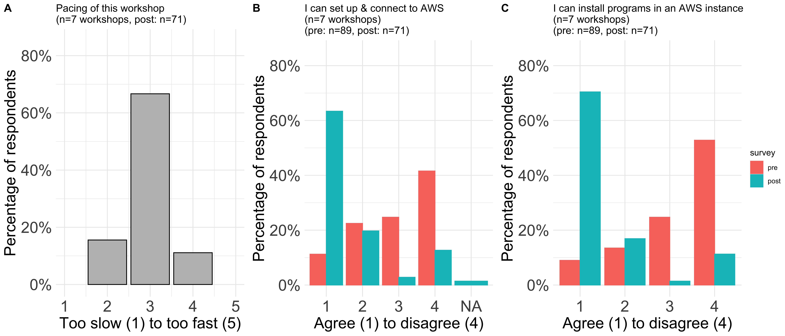

# AWS Jose Paper

# Summary

We present our lesson material and resources for introducing the use of Amazon Web Services (AWS, https://aws.amazon.com/) for cloud computation. This lesson was developed for the Common Fund Data Ecosystem (CFDE), an NIH initiative that aims to promote data re-use and cloud computing for biomedical research. The lesson materials, technology set-up instructions, and our instructional experiences can serve as a resource for prospective instructors who wish to re-use and remix our materials for teaching AWS and cloud computing.

# Statement of need

Amazon's Elastic Compute Cloud (EC2) is one of the most popular cloud-based platforms for computing and storage. Yet, there are very few freely available and comprehensive resources specifically designed for beginners. To fill this gap, we developed a curriculum to teach novice users (with minimal command-line and no cloud computation experience) about cloud computing in general, and AWS in particular.

We aimed to create modular content that requires minimal setup or operating system (OS) dependence, in line with the short-format (2-hour) instructor-led virtual workshops run by the CFDE. To this end, our lesson incorporates the use of IAM (Identity and Access Management) credentials that allow all workshop participants to log in to a common AWS 'root' account. The use of IAM credentials for teaching purposes, in combination with an OS-agnostic shell interface that runs in any web browser, greatly minimizes the initial setup time and allows participants to receive a comprehensive, free-of-charge introduction to working with AWS and the cloud.

All our tutorials are hosted on the [CFDE training website](https://training.nih-cfde.org/en/latest/) and include short instructional videos to accompany the self-guided text tutorials. If a user is unable to attend one of our live workshops, they can pick another medium of learning and work through content at their own pace.

# Curriculum

## Learning Objectives

As discussed in our [online lesson](https://training.nih-cfde.org/en/latest/Cloud-Platforms/Introduction_to_Amazon_Web_Services/introtoaws1.html), after completing our workshop, a learner should be able to:
- Set up an AWS cloud computer
- Connect to the AWS cloud computer
- Run multiple screen sessions and switch between them
- Download data from an AWS cloud computer to their local computer
- Terminate an AWS cloud computer

## Content

In the live workshops, we begin with a brief introduction to the basics of cloud computing and AWS, discuss commonly used (AWS) terminologies, and highlight the advantages of using AWS (over non-cloud platforms).

Next, we lead participants through launching and connecting to AWS instances. Here, participants log in to a common workshop AWS account using the IAM user credentials that we provide them.

After everyone has connected to their launched instances, we teach how to download an example file into the AWS instance from an online repository and run a basic bioinformatics software (FastQC) on the downloaded file.

Then, we use zoom breakout rooms to divide up the participants based on their local operating system (MacOS+Linux vs Windows users), and teach how to download files from the AWS instances to their local machines. Finally, we show how to manage the status and costs of AWS instances by demonstrating how to stop, hibernate and terminate previously launched instances.

Using Zoom reactions (raise hand, green checkmarks, and red crosses) we monitor participation and engagement and adjust the pace of the workshop accordingly. At the very end, participants are asked to do an in-class exercise that involves launching a new instance and adding a storage volume to it.

As a bonus module (time permitting), we teach shell terminal multiplexing for long-running jobs using the `screen` command.

## Instructional Design

Creating new AWS accounts can take several hours and moreover requires a valid credit card and cell phone number, which can prevent learners from participating. To streamline this process for our short-form workshops, we made use of Amazon's Identity and Access Management (IAM). With IAM, we provide and manage access to a common AWS account that participants can log in to for the duration of the workshop. Configuring IAM user credentials is done by the instructional team prior to the workshop. Instructors setting up workshop IAM credentials for the very first time would benefit from creating a new AWS account dedicated to running workshops. We also recommend setting up a customized URL for workshop sign-in (called an account alias). Then admin privileges must be assigned to the account, and a dedicated IAM user policy for the workshop must be created. Once created, the same AWS account and alias can be re-used for future workshops. A detailed guide to setting up IAM credentials for workshop use can be found on our [GitHub Wiki](https://github.com/nih-cfde/training-and-engagement/wiki/IAM-account-for-AWS)

The live workshops are ~2-hour events co-lead by two instructors. A moderator helps by posting relevant links and tracking questions and time. One or more helpers are usually present for one-on-one troubleshooting in zoom breakout rooms, as needed.

At the start of the workshop, we provide notes (using hackmd.io) containing abridged lesson materials, clickable links to lessons, surveys, an [FAQ discussions page](https://github.com/nih-cfde/training-and-engagement/discussions/categories/aws), [IAM user credentials](https://github.com/nih-cfde/training-and-engagement/wiki/IAM-account-for-AWS), and additional useful resources ([see example](https://hackmd.io/jTqsKMSZRU-L6NkJM4fZew?view)). These notes are available indefinitely and hosted on the website's [GitHub Wiki](https://github.com/nih-cfde/training-and-engagement/wiki).

Instructors use the screen-sharing feature of Zoom to teach participants how to launch and connect to AWS instances via the AWS console and web-browser shell. The use of IAM accounts allows instructors to keep track of the number, type, and region of launched instances, thereby gauging participation.

Participants are given pre- and post-workshop surveys to provide feedback on the scope, execution, pace, and overall usefulness of the workshop. We use feedback to fine-tune materials in future iterations.

# Workshop Experience

In less than a year, we conducted 7 Intro to AWS workshops, collectively training over 150 people. We see participation from diverse fields of study, career stages, and geographical locations.

Pre- and post-workshop survey responses suggest that our workshops are well-paced (Figure 1A) and accomplish the main learning objectives. After attending the workshop, many more participants felt confident in their ability to 1) set up an AWS instance and connect to it (Figure 1B), and 2) install software on an AWS instance (Figure 1C)

The surveys also helped us fine-tune lessons according to popular demand. For example, we added a section on downloading files from an AWS instance to the local machine, after receiving requests for it in the post-survey. Since all versions of our lesson materials are freely available on our [GitHub Wiki](https://github.com/nih-cfde/training-and-engagement/wiki), prospective instructors who wish to reuse these lessons can learn how our materials have evolved over time.

A majority of the post-survey comments were requests for increasing workshop duration, increasing the number of in-class activities, and/or to add future workshops covering advanced topics. Such feedback suggests that our lessons are interesting, useful, and motivate participants to explore the topic further.

A particularly big challenge in virtual training has been audience participation and engagement. This is especially true for an Intro to AWS lesson because the different steps involved in setting up, launching, and running tasks on an AWS instance are tightly interconnected. To ensure no person got left behind, we built in regular checkpoints, asking learners to give us non-verbal feedback using Zoom reactions (raised hands, checkmarks, and crosses). Helpers communicated with non-responders using the direct message feature of Zoom to check in and/or troubleshoot problems. While this strategy was immensely successful in smaller workshops (<25 people), we tended to see lower engagement in larger workshops.

# Conclusion

Our AWS curriculum and online instruction model have been successful in providing novice users with a comprehensive introduction to AWS and the cloud. Since all our lessons and set-up instructions are publicly available, we believe that it can serve as a resource for prospective instructors who are interested in teaching cloud-based tools via an online instruction platform.

# Acknowledgements

Thanks to all the workshop participants for attending and providing valuable survey feedback that made this article possible. Our AWS lessons are inspired by training material delivered at [ANGUS 2016](https://angus.readthedocs.io/en/2016/amazon/index.html).

# Funding

This work was funded by the NIH Common Fund Data Ecosystem --grant info?--.

# Author Contributions

AP, JS, SC, and ML were the main material developers and workshop instructors, while JW helped coordinate the workshops. CTB and AC supervised the project.

# Conflicts of Interest

None.
